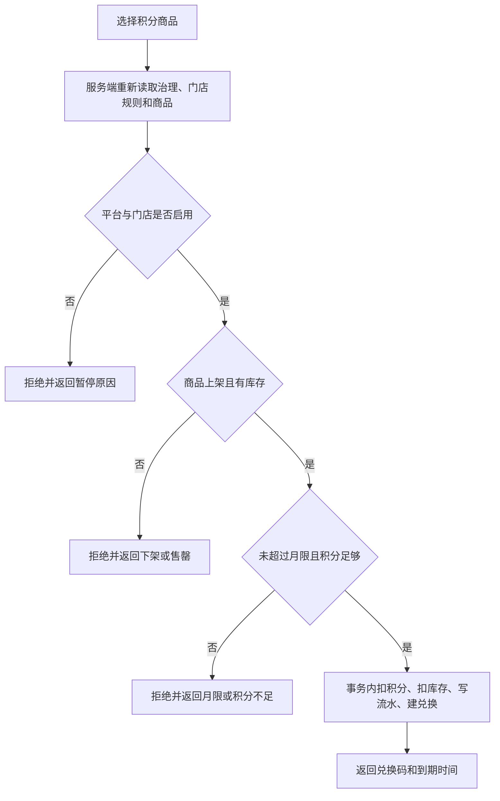
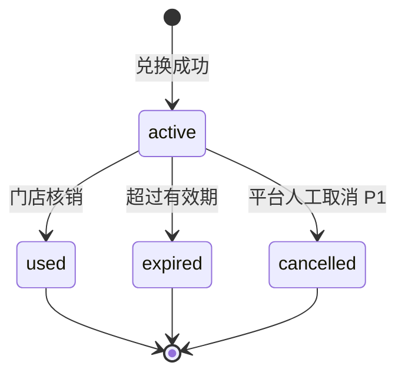

# 燎客 AI 积分商城与治理系统 PRD v3.1.1

> 文档状态：开发交付版<br>
> 最后更新：2026-07-15<br>
> 适用产品：顾客端小程序、商家端小程序、燎客平台管理后台、统一业务后端<br>
> 基线版本：`PRD-liaoke-ai-mvp-v3.0.md` + 积分模块 v3.1<br>
> 评审原型：[https://liaoke-ai.vercel.app](https://liaoke-ai.vercel.app)<br>
> 本文档优先级：涉及积分业务时，本文档高于 v3.0、旧接口示例和旧数据库默认值。

## 0. 本次版本结论

积分商城采用“平台治理、商家经营、店员执行”的三级控制模式，不由单一角色完全控制：

1. **燎客平台**控制全局开关、新门店默认规则、商家可调整范围和审计。
2. **商家老板**控制本店开关、本店积分发放规则和积分有效期。
3. **商家老板、店长**共同管理本店积分商品、库存、积分价格和上下架。
4. **店员**只负责核销，不得修改规则或商品。
5. **顾客**只能查看和使用自己在当前门店的积分，不支持跨店、提现、转让或抵现金。

权限优先级固定为：

```text
平台治理 > 门店规则 > 商品状态 > 用户账户条件
```

任何下级设置都不能绕过上级限制。

## 1. 产品目标

### 1.1 业务目标

- 用低现金成本的赠品或服务提升复购和到店频次。
- 把消费、签到、AI 晒圈、资料完善和生日触达串成可追踪的积分闭环。
- 让商家拥有日常经营空间，同时由平台控制积分成本和合规边界。
- 所有积分变化可追溯、可审计、不可被前端篡改。

### 1.2 用户价值

- 顾客明确知道“有多少积分、怎么获得、能换什么、何时过期”。
- 商家可以用低成本商品或服务设计复购激励。
- 店员只处理核销，不承担复杂配置工作。
- 平台可以批量管理风险，不需要逐店手工干预。

### 1.3 成功指标

首店上线后按门店统计：

| 指标 | 定义 |
|---|---|
| 积分账户激活率 | 有积分流水的会员数 / 扫码会员数 |
| 30 日兑换率 | 30 日内发生兑换的会员数 / 有可用积分会员数 |
| 兑换核销率 | 已核销兑换数 / 已创建兑换数 |
| 积分复购率 | 兑换会员 30 日内再次到店人数 / 兑换会员数 |
| 积分成本率 | 已核销礼品实际成本 / 同期实付营业额 |
| 异常率 | 重复发放、超发、重复核销等异常数 / 积分事务总数 |

## 2. 系统范围

### 2.1 P0 必须交付

- 顾客端：积分账户、积分流水、积分商城、商品详情、确认兑换、兑换码、兑换记录。
- 商家端：积分规则、积分商品、积分兑换核销、核销记录。
- 平台后台：积分治理、全局开关、默认值、商家边界、审计记录。
- 后端：规则判定、积分入账、积分扣减、库存扣减、兑换码、核销、过期任务、幂等与并发控制。
- 数据分析：积分发放、消耗、核销和成本基础指标。

### 2.2 P0 不做

- 积分抵现金、积分加现金兑换。
- 积分提现、转账、赠送或跨门店通用。
- 会员等级倍率、连续签到翻倍、抽奖、积分竞拍。
- 商家自定义任意积分来源。
- 顾客自行取消兑换或自动退积分。
- 多门店品牌集团共用积分池。

以上能力必须重新立项，不得由开发人员自行扩展。

## 3. 当前实施状态

### 3.1 已完成

- 三端 React/Vite 交互原型已覆盖积分治理、门店规则、积分商品、顾客兑换和店员核销。
- 顾客端、商家端和平台后台的积分商品已改为同一状态源。
- 原型已实现平台与门店暂停、商品上下架、库存扣减、积分流水和重复核销拦截。
- 当前原型测试基线：58 个单元测试通过、149 个 E2E 测试通过、生产构建通过。
- Vercel 正式评审地址已上线。

### 3.2 尚未完成

- 原生顾客端和商家端小程序尚未同步本轮完整三端原型。
- 当前原生小程序仍主要使用 mock 数据，未接生产 API。
- 生产数据库、定时过期任务、消息通知和真实审计日志需由开发团队实现。
- 微信正式预览需要真实 AppID，当前 `touristappid` 不能完成正式设备预览和发布。

### 3.3 开发评审直达地址

- 顾客积分商城：`https://liaoke-ai.vercel.app/?surface=customer&route=points-store&scenario=returning-customer`
- 商家老板积分规则：`https://liaoke-ai.vercel.app/?surface=merchant&route=points-rules&role=owner`
- 商家店长积分商品：`https://liaoke-ai.vercel.app/?surface=merchant&route=points-products&role=manager`
- 店员积分核销：`https://liaoke-ai.vercel.app/?surface=merchant&route=verify-hub&role=staff&scenario=points-verification`
- 平台积分治理：`https://liaoke-ai.vercel.app/?surface=admin&route=points-governance&role=super_admin`

Vercel 页面用于确认交互、文案和权限，不可直接作为后端业务规则实现。

## 4. 四套价值体系边界

| 价值类型 | 用途 | 是否减少 | 是否可抵现金 | 是否可提现 | 是否可转让 |
|---|---|---:|---:|---:|---:|
| 成长值 | 会员等级判断 | 否 | 否 | 否 | 否 |
| 返现余额 | 下次消费抵扣 | 是 | 是 | 否 | 否 |
| 推荐抵扣券 | 老带新到店激励 | 核销后失效 | 是 | 否 | 否 |
| 积分 | 兑换赠品或服务 | 是 | 否 | 否 | 否 |

积分页面、接口、数据库字段和运营文案不得出现“积分抵现”“积分余额提现”“积分转赠”等表达。

## 5. 角色与权限

### 5.1 权限矩阵

| 能力 | 超级管理员 | 平台运营管理员 | 商家老板 | 商家店长 | 商家店员 | 顾客 |
|---|---:|---:|---:|---:|---:|---:|
| 查看平台积分治理 | 是 | 是 | 否 | 否 | 否 | 否 |
| 发布平台治理规则 | 是 | 否 | 否 | 否 | 否 | 否 |
| 暂停全平台积分 | 是 | 否 | 否 | 否 | 否 | 否 |
| 查看本店积分规则 | 是 | 按授权只读 | 是 | 是 | 否 | 否 |
| 修改本店积分规则 | 否 | 否 | 是 | 否 | 否 | 否 |
| 管理本店积分商品 | 否 | 否 | 是 | 是 | 否 | 否 |
| 核销本店积分兑换码 | 否 | 否 | 是 | 是 | 是 | 否 |
| 查看本人积分和流水 | 否 | 否 | 否 | 否 | 否 | 是 |
| 兑换本店商品 | 否 | 否 | 否 | 否 | 否 | 是 |

### 5.2 强制规则

- 后端必须校验角色与 `store_id`，不能只依赖前端隐藏按钮。
- 平台运营管理员为只读角色，只有超级管理员可以发布治理规则。
- 店长进入积分规则页时只能查看，并展示“积分发放规则仅老板可以修改”。
- 店员不得访问商品、规则、员工管理或经营配置接口。
- 商家角色只能操作当前绑定门店的数据。

## 6. 平台积分治理

### 6.1 全局总开关

字段：`enabled`，默认 `true`。

关闭后：

- 暂停所有门店的新积分发放和新积分兑换。
- 保留门店规则、商品、顾客余额、积分流水和兑换历史。
- 已经生成且仍在有效期内的兑换码允许继续核销，避免损害顾客已获得权益。
- 商家后台显示平台暂停原因，门店不得自行恢复。

恢复后：

- 门店按照各自已保存规则继续运行。
- 不补发暂停期间本应产生的签到、AI 晒圈或生日积分。
- 消费积分是否补发必须通过人工补偿单处理，不得批量静默补发。

### 6.2 新门店默认值

| 配置项 | 默认值 |
|---|---:|
| 每实付 1 元 | 10 积分 |
| 每日到店签到 | 5 积分 |
| AI 晒圈成功 | 50 积分 |
| 完善个人资料 | 100 积分 |
| 生日当月到店消费 | 200 积分 |
| 积分有效期 | 365 天 |

### 6.3 商家调整边界

| 配置项 | 平台边界 |
|---|---:|
| 每实付 1 元积分上限 | 20 |
| 每日签到积分上限 | 20 |
| AI 晒圈积分上限 | 100 |
| 完善资料积分上限 | 300 |
| 生日积分上限 | 500 |
| 单个商品最低积分价 | 100 |
| 单个商品最高积分价 | 5000 |
| 每人每月单商品限兑上限 | 5 次 |

积分发放项允许商家设置为 `0`，表示关闭该单项奖励。商品积分价和每月限兑次数不得为 `0`。

### 6.4 发布校验

- 默认值不得高于对应商家上限。
- 商品最低积分价不得高于商品最高积分价。
- 每人每月限兑上限不得小于 1。
- 所有数值必须为非负整数。
- 有效期只允许 `90`、`180`、`365` 天或永久。
- 每次发布生成新版本号和审计记录，不覆盖历史版本。

### 6.5 规则生效原则

- 新门店创建时复制当时平台默认值，不与平台默认值保持实时联动。
- 平台修改默认值只影响之后创建的门店。
- 平台修改上下限后，已存在的门店规则如果越界，继续保留但标记“待整改”，不得继续编辑保存为越界值。
- 需要强制调整存量门店时，必须走单独批量变更任务并记录影响门店和操作人。

## 7. 商家积分经营

### 7.1 本店规则

商家老板可配置：

- 本店积分功能开关。
- 每实付 1 元积分。
- 每日签到积分。
- AI 晒圈积分。
- 完善资料积分。
- 生日当月到店消费积分。
- 积分有效期：90、180、365 天或永久。

关闭本店积分后，行为与平台暂停一致：停止新发放和新兑换，保留余额和历史，已生成有效兑换码仍可核销。

规则修改只影响修改后新产生的积分流水，不追溯修改历史流水及其过期时间。

### 7.2 积分商品

老板和店长可配置：

| 字段 | 规则 |
|---|---|
| 商品名称 | 必填，1-30 个字符 |
| 商品图片 | 必填，HTTPS 图片地址或已上传媒体 ID |
| 分类 | 饮品、小菜、小吃、服务 |
| 所需积分 | 必须在平台商品积分价范围内 |
| 库存 | 非负整数，0 表示售罄 |
| 每人每月上限 | 1 至平台上限 |
| 状态 | 上架、下架 |
| 使用说明 | 必填，说明堂食、时段、门店和使用限制 |
| 兑换码有效期 | P0 固定为兑换后 30 天 |

生产系统不得使用 `9999` 表示无限库存。后续若支持无限库存，应使用独立字段 `stock_mode=unlimited`。

### 7.3 商品变更影响

- 改价只影响新兑换；已创建兑换保留兑换时的商品名、积分价和规则快照。
- 下架后不再出现在顾客商城，但已创建兑换码仍可核销。
- 库存为 0 时显示“已售罄”，不得创建兑换。
- 删除商品仅允许软删除，历史兑换必须可追溯。

## 8. 积分获得逻辑

### 8.1 消费积分

计算公式：

```text
获得积分 = floor(符合积分条件的实付金额 × 本店每元积分)
```

符合积分条件的实付金额以服务端结算结果为准，前端不得上传最终积分数。

- 订单支付或核销成功后发放一次。
- 同一个 `order_id` 只能发放一次。
- 退款时按退款金额反向扣回对应积分；余额不足时允许账户进入“待追缴”状态，但不可直接出现负可用积分。
- 退款和冲正必须创建新流水，不得修改原始流水。

### 8.2 每日签到

- 同一顾客、同一门店、同一自然日最多一次。
- 自然日按 `Asia/Shanghai` 计算。
- 使用服务端唯一键或幂等键拦截重复请求，不能只依赖 Redis 临时键。

### 8.3 AI 晒圈

- 同一 AI 创作任务最多奖励一次。
- 只有生成成功且用户执行明确的发布或分享动作后才发放。
- 单纯进入 AI 页面、生成失败或重复点击分享不得发放。

### 8.4 完善资料

- 同一顾客、同一门店只发放一次。
- 顾客必须主动完成门店配置的必要资料项。
- 手机号和生日属于自愿授权信息，不得在首次进入时强制索取。

### 8.5 生日奖励

- 生日当月完成一笔有效消费后发放。
- 同一顾客、同一门店、同一自然年最多一次。
- 生日修改后不得重复领取当年奖励。

## 9. 顾客端流程

### 9.1 进入与隐私

- 服务与隐私同意框默认不勾选。
- 未同意前不得进入需要处理个人信息的业务流程。
- 手机号授权不是进入小程序的前置条件，只在领取需要绑定账户的权益时按需请求。
- 用户拒绝手机号授权后，仍可浏览公开内容；需要绑定的操作显示明确原因，不诱导重复弹窗。

### 9.2 浏览积分商城

只展示当前门店 `active` 且未软删除的商品。

页面必须展示：

- 当前可用积分。
- 平台或本店暂停状态。
- 商品名称、图片、分类、积分价、当前库存和本月已兑次数。
- 积分不足、售罄、达到月限或暂停时的明确原因。

### 9.3 发起兑换



确认弹窗必须写明商品、积分消耗、30 天有效期和过期不自动退积分。

兑换成功后原子执行：

1. 锁定积分账户和商品库存记录。
2. 再次校验余额、库存、月限、平台开关和门店开关。
3. 扣减积分。
4. 扣减商品库存。
5. 写入负数积分流水。
6. 创建状态为 `active` 的兑换记录和唯一兑换码。
7. 提交事务后返回结果。

任一步失败时必须整体回滚。

### 9.4 兑换记录

顾客可查看：

- 待使用 `active`
- 已使用 `used`
- 已过期 `expired`
- 已取消 `cancelled`

待使用详情展示二维码、8 位短码、门店、商品、积分消耗、兑换时间、过期时间和使用说明。

## 10. 商家核销流程

### 10.1 核销入口

商家核销台统一包含：

- 扫码核销
- 手动核销
- 余额核销
- 推荐券核销
- 积分兑换核销

产品文案统一使用“推荐券核销”，不在按钮中使用过长的“老带新抵扣券核销”。

### 10.2 两阶段核销

1. 扫码或输入兑换码，调用核销预检接口。
2. 展示脱敏顾客信息、商品、积分消耗、兑换时间和过期时间。
3. 店员点击“确认核销”。
4. 服务端将兑换状态从 `active` 原子更新为 `used`。
5. 记录核销人、角色、门店、设备、时间和请求 ID。

### 10.3 校验条件

- 兑换码存在。
- 兑换码属于当前门店。
- 当前状态为 `active`。
- 未超过 `expire_at`。
- 当前账号拥有 `verify` 权限。

核销成功不再扣库存和积分，因为二者已在顾客兑换时扣除。

### 10.4 重复与并发

- 同一兑换码只能从 `active` 更新为 `used` 一次。
- 两台设备同时确认时，只允许一个请求成功。
- 重复请求返回“该兑换码已使用”和首次核销时间，不得产生第二条成功记录。
- 核销接口必须支持幂等键。

## 11. 状态机

### 11.1 积分兑换状态



P0 不允许顾客主动取消。兑换码过期不自动退积分、不自动回库存；该规则必须在兑换确认前明确告知。

### 11.2 商品状态

```text
draft -> active -> inactive -> active
```

- P0 创建商品后可直接选择上架或下架。
- 已产生历史兑换的商品只允许软删除。

### 11.3 治理规则状态

```text
draft -> published -> retired
```

任意时刻只能有一个生效中的平台积分治理版本。

## 12. 数据模型

### 12.1 `platform_points_governance`

平台治理版本表：

- `id`
- `version`
- `status`: `draft/published/retired`
- `enabled`
- `default_spend`
- `default_check_in`
- `default_ai_share`
- `default_profile`
- `default_birthday`
- `default_expiry_days`，永久使用 `0`
- `max_spend`
- `max_check_in`
- `max_ai_share`
- `max_profile`
- `max_birthday`
- `min_product_points`
- `max_product_points`
- `max_monthly_limit`
- `effective_at`
- `created_by`
- `created_at/updated_at`

### 12.2 `store_points_rules`

每店一条当前规则：

- `store_id`，唯一索引
- `enabled`
- `spend/check_in/ai_share/profile/birthday`
- `expiry_days`，永久使用 `0`
- `platform_policy_version`
- `version`
- `updated_by`
- `created_at/updated_at`

### 12.3 `points_accounts`

每个顾客在每个门店一条积分账户：

- `id/account_code`
- `store_id/member_id`
- `available_points`
- `total_earned_points`
- `total_used_points`
- `total_expired_points`
- `status`: `active/frozen/pending_recovery`
- `lock_version`
- `created_at/updated_at`

唯一索引：`store_id + member_id`。

### 12.4 `points_transactions`

积分流水只追加、不修改、不物理删除：

- `id/transaction_code`
- `account_id/store_id/member_id`
- `tx_type`: `consume_earn/sign_in/ai_share/profile_complete/birthday/redemption/refund_reversal/expired/manual_adjustment`
- `points_delta`
- `points_before/points_after`
- `source_type/source_id`
- `redemption_id`
- `rule_snapshot_json`
- `expire_at`
- `idempotency_key`，唯一索引
- `operator_type/operator_id`
- `created_at`

### 12.5 `points_products`

- `id/product_code/store_id`
- `product_name/product_type/image_url`
- `points_price`
- `stock_quantity`
- `monthly_limit_per_user`
- `status`: `draft/active/inactive/deleted`
- `usage_instructions`
- `sort_order`
- `version`
- `created_by/updated_by`
- `created_at/updated_at/deleted_at`

### 12.6 `points_redemptions`

- `id/redemption_code`
- `store_id/member_id/account_id/product_id`
- `product_snapshot_json`
- `points_cost`
- `status`: `active/used/expired/cancelled`
- `redeemed_at/expire_at`
- `used_at/verifier_id/verifier_role/verification_device_id`
- `cancelled_at/cancelled_by/cancel_reason`
- `idempotency_key`，唯一索引
- `created_at/updated_at`

兑换码必须使用不可预测的安全随机数生成，不得用自增 ID 直接拼接。

## 13. API 清单

### 13.1 顾客端

| 方法 | 路径 | 用途 |
|---|---|---|
| GET | `/api/points/account` | 查询当前门店积分账户和规则摘要 |
| GET | `/api/points/transactions` | 分页查询积分流水 |
| GET | `/api/points/products` | 查询当前门店可见商品 |
| POST | `/api/points/redeem` | 兑换商品 |
| GET | `/api/points/redemptions` | 查询本人兑换记录 |
| GET | `/api/points/redemptions/{id}` | 查询兑换码详情 |
| POST | `/api/points/sign-in` | 每日签到 |

### 13.2 商家端

| 方法 | 路径 | 权限 | 用途 |
|---|---|---|---|
| GET | `/api/store/points/rules` | 老板、店长只读 | 查询本店规则和平台边界 |
| PUT | `/api/store/points/rules` | 老板 | 保存本店规则 |
| GET | `/api/store/points/products` | 老板、店长 | 查询本店商品 |
| POST | `/api/store/points/products` | 老板、店长 | 新建商品 |
| PUT | `/api/store/points/products/{id}` | 老板、店长 | 编辑商品 |
| POST | `/api/store/verify/points-redemption/preview` | 老板、店长、店员 | 核销预检 |
| POST | `/api/store/verify/points-redemption` | 老板、店长、店员 | 确认核销 |

### 13.3 平台后台

| 方法 | 路径 | 权限 | 用途 |
|---|---|---|---|
| GET | `/api/admin/points/governance` | 超级管理员、平台运营管理员 | 查询当前与历史治理版本 |
| POST | `/api/admin/points/governance/drafts` | 超级管理员 | 创建治理草稿 |
| PUT | `/api/admin/points/governance/drafts/{id}` | 超级管理员 | 编辑治理草稿 |
| POST | `/api/admin/points/governance/drafts/{id}/publish` | 超级管理员 | 发布治理版本 |
| GET | `/api/admin/points/audit-logs` | 超级管理员、平台运营管理员 | 查询积分治理审计 |

### 13.4 内部事件

消费、AI 晒圈、资料完善、生日奖励通过内部领域事件触发，不允许客户端直接提交奖励积分值：

- `ORDER_COMPLETED`
- `ORDER_REFUNDED`
- `AI_SHARE_COMPLETED`
- `PROFILE_COMPLETED`
- `BIRTHDAY_PURCHASE_COMPLETED`

## 14. 幂等、事务与安全

### 14.1 幂等键

以下写接口必须支持 `X-Idempotency-Key`：

- 积分发放
- 顾客兑换
- 商家核销
- 退款冲正
- 平台批量调整

同一幂等键、同一业务主体的重复请求返回首次结果，不重复写流水。

### 14.2 事务边界

- 发放积分：账户更新和积分流水同一事务。
- 兑换商品：账户、流水、库存、兑换记录同一事务。
- 核销：兑换状态和核销记录同一事务。
- 退款：冲正流水和账户调整同一事务。

### 14.3 安全要求

- 积分价格、余额、角色和门店归属全部由服务端读取。
- 二维码只携带短期兑换凭证，不包含手机号、生日等个人信息。
- 核销码查询接口按账号、门店、IP 和设备限流。
- 所有平台治理、门店规则、人工调整和核销操作写审计日志。
- 日志中的手机号、OpenID 和兑换码必须脱敏。

## 15. 过期规则

### 15.1 积分过期

- P0 使用按笔过期，每笔获得流水写入 `expire_at`。
- 扣积分时优先消耗最早过期的积分。
- 每日定时任务生成 `expired` 负数流水，不直接改历史获得流水。
- 永久积分的 `expire_at` 为空。
- 到期前 30、7、1 天可发送提醒，消息能力未开通时至少在小程序内提示。

### 15.2 兑换码过期

- 兑换码默认在兑换后 30 天到期。
- 到期任务将 `active` 改为 `expired`。
- P0 过期不自动退积分、不回库存。
- 因门店无法履约需要补偿时，由平台人工调整并留下原因和审计记录。

## 16. 错误码与用户文案

| 错误码 | 顾客或商家文案 |
|---|---|
| `POINTS_PLATFORM_PAUSED` | 平台已暂停积分功能，余额和历史记录不受影响 |
| `POINTS_STORE_PAUSED` | 本店已暂停积分功能，余额和历史记录不受影响 |
| `POINTS_PRODUCT_MISSING` | 该积分商品不存在 |
| `POINTS_PRODUCT_INACTIVE` | 该积分商品已下架 |
| `POINTS_SOLD_OUT` | 该积分商品已售罄 |
| `POINTS_MONTHLY_LIMIT` | 本月兑换次数已用完 |
| `POINTS_INSUFFICIENT` | 当前积分不足 |
| `POINTS_CODE_INVALID` | 兑换码无效 |
| `POINTS_CODE_EXPIRED` | 兑换码已过期 |
| `POINTS_CODE_USED` | 兑换码已使用 |
| `POINTS_STORE_MISMATCH` | 该兑换仅限原门店使用 |
| `POINTS_FORBIDDEN` | 当前账号无权执行此操作 |
| `POINTS_POLICY_OUT_OF_RANGE` | 配置超出平台允许范围 |
| `POINTS_CONCURRENT_CONFLICT` | 操作状态已变化，请刷新后重试 |

前端不得把数据库异常、堆栈或内部 ID 直接展示给用户。

## 17. 三端页面要求

### 17.1 顾客端小程序

- `我的积分`：余额、规则摘要、到期提醒、流水入口。
- `积分商城`：分类、商品、暂停状态、不可兑换原因。
- `积分商品详情`：库存、月限、使用说明、30 天有效期。
- `确认兑换`：明确积分扣减和过期规则。
- `兑换成功/兑换码`：二维码、短码、门店、到期时间。
- `我的兑换`：待使用、已使用、已过期。

### 17.2 商家端小程序

- 老板：积分规则、积分商品、核销、核销记录。
- 店长：积分规则只读、积分商品可写、核销、核销记录。
- 店员：核销和核销记录，不显示经营配置入口。

### 17.3 平台管理后台

- 当前全平台状态。
- 新门店默认规则。
- 商家调整边界。
- 发布前校验和发布结果。
- 历史治理版本和操作审计。
- 平台运营管理员进入时所有控件禁用并显示只读提示。

## 18. 非功能要求

- 所有金额使用十进制定点数，积分使用整数。
- 所有业务时间服务端保存 UTC，展示按 `Asia/Shanghai`。
- 顾客列表和商品列表必须分页；默认 20 条，最大 100 条。
- 兑换和核销接口 P95 小于 800ms，不包含第三方网络耗时。
- 核心写接口可用性目标不低于 99.9%。
- 业务日志至少保留 180 天，积分账务与审计数据按公司数据制度长期保留。
- 禁止在生产页面使用固定演示日期、固定兑换码和本地 fixture 作为真实数据。

## 19. 验收标准

### 19.1 权限验收

- 超级管理员可发布平台治理，平台运营管理员只能查看。
- 老板可改本店规则和商品。
- 店长可改商品但不能改本店积分规则。
- 店员只能核销，直接请求规则或商品写接口返回 403。

### 19.2 治理验收

- 商家输入超过平台上限时，前端提示且后端拒绝。
- 平台默认值高于商家上限时不能发布。
- 平台关闭后，所有门店停止新发放和新兑换。
- 平台或门店关闭后，余额、流水、配置和历史兑换仍可查看。
- 暂停前生成的有效兑换码仍能核销。

### 19.3 兑换验收

- 积分不足、售罄、下架、超过月限时均不能兑换。
- 兑换成功后积分和库存各扣减一次，并新增一条积分流水和一条兑换记录。
- 同一幂等键重复提交不重复扣积分或库存。
- 10 个并发请求争抢最后 1 份库存时只能 1 个成功。
- 兑换成功后顾客端和商家端读取同一商品与库存数据。

### 19.4 核销验收

- 只有当前门店有核销权限的账号可以核销。
- 同一兑换码只能核销一次。
- 跨店、过期、已使用和不存在的兑换码返回不同错误原因。
- 核销记录包含核销人、角色、门店和时间。

### 19.5 隐私与文案验收

- 首次进入的隐私同意框默认未勾选。
- 手机号授权不是进入小程序的前置条件。
- 积分相关页面不出现提现、转赠或抵现金承诺。
- 页面日期、库存、积分和状态来自接口，不使用硬编码演示值。

## 20. 测试要求

### 20.1 单元测试

- 平台治理参数校验。
- 角色权限矩阵。
- 平台、门店、商品、账户四级拦截顺序。
- 积分计算、取整、到期和退款冲正。
- 兑换与核销状态机。

### 20.2 集成测试

- 数据库事务回滚。
- 幂等键重复请求。
- 账户与库存并发锁。
- 跨门店数据隔离。
- 过期定时任务。

### 20.3 E2E 测试

- 顾客完整兑换路径。
- 老板修改规则。
- 店长管理商品。
- 店员核销和重复核销。
- 超级管理员发布治理和全局暂停。
- 平台运营管理员只读。

## 21. 开发顺序

1. **规则与数据层**：完成治理表、门店规则、账户、流水、商品、兑换和审计表。
2. **平台后台**：先完成治理发布和边界校验，给后续商家端提供真实约束。
3. **商家端**：完成本店规则、商品和核销。
4. **顾客端**：完成账户、商城、兑换和兑换记录。
5. **领域事件**：接入消费、签到、AI 晒圈、资料和生日积分。
6. **过期与通知**：接入定时任务、到期提醒和异常告警。
7. **灰度上线**：先开 1 家试点门店，再按平台开关扩店。

## 22. 上线闸口

上线前必须满足：

- 使用真实小程序 AppID 完成顾客端和商家端设备验收。
- 关闭前端 mock，所有积分页面接测试环境和生产环境 API。
- 完成数据库备份、回滚脚本和治理规则初始化。
- 完成并发兑换、重复核销、跨店核销和越权接口测试。
- 平台全局开关可在不发版的情况下生效。
- 运营、商家老板和店员完成各自角色验收。
- 隐私政策、用户协议和积分规则页包含积分不可提现、不可转让、不可抵现金说明。

## 23. 已知文档冲突与处理

开发前必须修正以下旧值：

- `docs/standard-mvp/06-database-schema.sql` 旧默认值为“每 1 元 1 积分”。
- `docs/standard-mvp/10-api-contract.md` 部分示例仍返回“每 1 元 1 积分”。
- 当前正式默认值为“每实付 1 元 10 积分”，以本文档为准。

存量门店如果已经保存明确规则，不做静默批量修改；新门店使用 10 积分默认值。数据库附件和接口附件应在正式开发前与本 PRD 同步。

## 24. 变更记录

### v3.1.1 - 2026-07-15

#### 新增

- 新增平台积分治理、全局开关、新门店默认值和商家调整边界。
- 新增超级管理员、平台运营管理员、老板、店长、店员和顾客权限矩阵。
- 新增平台暂停、门店暂停、商品状态、库存、月限和账户条件的拦截顺序。
- 新增生产数据模型、API 清单、幂等、并发、错误码、验收标准和上线闸口。
- 新增首次进入隐私同意默认未勾选和手机号按需授权要求。

#### 修改

- 将积分控制模式从“门店自行配置”调整为“平台治理、商家经营、店员执行”。
- 明确老板管理规则，老板和店长管理商品，店员只核销。
- 明确积分商品、顾客商城和核销台必须使用同一后端数据源。
- 明确兑换时立即扣积分和库存，核销时只更新兑换状态。
- 统一默认积分比例为每实付 1 元 10 积分。
- 将旧版重复、口语化说明合并为可直接开发和验收的交付文档。
