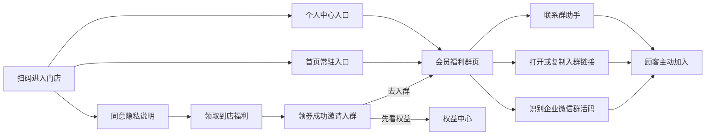

# 燎客私域会员群 PRD v3.1.2

> 状态：开发交付版  
> 日期：2026-07-15  
> 适用端：顾客端小程序、商家端、平台管理后台、统一业务后端

## 1. 产品结论

私域会员群由**商家老板负责配置和日常经营**，平台负责提供入口、权限、数据统计、审计和风险治理。店长可以查看配置和转化数据，但默认不能修改；店员不接触群配置。顾客是否入群完全自愿，不入群或退群不得影响已经领取的券、余额、积分和会员权益。

燎客不承诺“扫码后静默入群”。顾客领券后看到明确邀请，可以通过企业微信群活码、入群链接或群助手完成主动加入。

## 2. 目标与非目标

目标：

- 把扫码领福利的到店顾客转化为门店可持续触达的私域会员。
- 在领券成功、首页和个人中心提供连续但不过度打扰的入群入口。
- 让商家自行更换企业微信群活码、文案和群助手，不依赖平台逐店改代码。
- 区分页面曝光、入群点击、链接复制、助手求助和确认入群，形成真实漏斗。
- 在群满、二维码过期和客服不可用时提供清晰兜底。

非目标：

- 不强制关注、加群或授权手机号。
- 不把点击链接等同于实际入群。
- 不允许商家导出顾客隐私数据后使用个人微信批量骚扰。
- 不在 P0 阶段建设完整群聊管理、自动群发或社群 CRM。

## 3. 角色与控制权

| 事项 | 顾客 | 商家老板 | 店长 | 店员 | 平台运营 | 超级管理员 |
|---|---:|---:|---:|---:|---:|---:|
| 自主决定是否入群 | 是 | - | - | - | - | - |
| 查看群名称、福利和活码 | 是 | 是 | 是 | 否 | 只读巡检 | 是 |
| 启停顾客端入口 | 否 | 是 | 否 | 否 | 否 | 风险时可停用 |
| 修改活码、链接和文案 | 否 | 是 | 否 | 否 | 否 | 应急纠错 |
| 查看本店转化漏斗 | 否 | 是 | 是 | 否 | 跨店只读 | 是 |
| 日常群内容和成员管理 | 成员自主管理 | 是 | 商家内部授权 | 商家内部授权 | 否 | 否 |
| 平台风控与审计 | 否 | 配合 | 配合 | 配合 | 巡检 | 处置 |

## 4. 顾客端流程

### 4.1 领券成功引导

- 主操作为“加入门店福利群”，次操作为“先查看权益”。
- 展示群内真实价值，例如隐藏券、生日礼、新品试吃和午市提醒。
- 明示“入群完全自愿，不影响已领权益”。
- 同一顾客不应在一次会话内反复弹出强提示；拒绝后保留首页和个人中心常驻入口即可。

### 4.2 会员福利群页

页面顺序：群价值说明、三项核心福利、企业微信群活码、有效期、打开/复制入口、群助手兜底、自愿和安全提示。

状态要求：

| 状态 | 顾客端表现 |
|---|---|
| 正常 | 展示活码、入口和群助手 |
| 活码即将过期 | 显示有效期，商家端提前预警 |
| 活码已过期 | 主按钮降级，突出联系群助手 |
| 群已满 | 显示群助手或下一群活码 |
| 入口关闭 | 显示维护说明，已领权益不受影响 |
| 链接复制失败 | 提示长按识别二维码或联系助手 |

## 5. 商家端配置

入口：`活动与玩法 -> 配置私域福利群`。

| 字段 | 规则 | 推荐值 |
|---|---|---|
| 启用入口 | 老板可开关 | 完成真机测试后再开启 |
| 群名称 | 必填，最多 24 字 | 门店名 + 会员福利群/数字分群 |
| 入群福利说明 | 必填，最多 60 字 | 只写可兑现的 2 至 4 项福利 |
| 企业微信群入群链接 | 启用时必填，必须 HTTPS | 企业微信提供的有效入口 |
| 群活码图片 | HTTPS 或站内资源 | 企业微信群活码，不使用个人微信收款码 |
| 活码有效期 | 启用时必填 | 到期前至少 7 天更换 |
| 群助手名称 | 最多 20 字 | 门店名 + 群福利助手 |
| 入群欢迎语 | 最多 120 字 | 群价值、频率、退群自由和安全提醒 |

保存后只影响新的顾客访问，不改变已有券、积分和历史数据。每次保存应记录操作人、门店、修改前后值、时间和原因。

## 6. 数据与指标

事件建议：

| 事件 | 含义 | 是否等于实际入群 |
|---|---|---:|
| `group_join_page_show` | 打开福利群页 | 否 |
| `group_join_click` | 点击打开入群入口 | 否 |
| `group_join_qr_preview` | 放大活码 | 否 |
| `group_join_link_copy` | 复制入群链接 | 否 |
| `group_join_assistant_request` | 请求群助手 | 否 |
| `group_join_confirmed` | 企业微信回调或人工核验确认加入 | 是 |

核心漏斗：

- 群页到达率 = 群页访问人数 / 扫码有效人数。
- 入群意向率 = 去重入群点击人数 / 群页访问人数。
- 确认入群率 = 确认入群人数 / 去重入群点击人数。
- 私域沉淀率 = 确认入群人数 / 扫码有效人数。
- 7 日退群率、群消息触达率和群内券核销率在接入企业微信回调后计算。

所有漏斗按 `store_id + member_id + 日期` 去重。没有企业微信回调时，后台必须标注“入群点击”，不得写成“入群人数”。

## 7. 运营建议

### 7.1 推荐群内容结构

- 60% 实用福利：隐藏券、会员日、库存明确的赠品。
- 25% 门店内容：新品、菜品知识、用餐时段提醒。
- 15% 互动关怀：生日、投票、顾客作品精选。
- 常规消息建议每周 2 至 4 次，避免全天高频刷屏。
- 每条优惠都写清门店、时间、门槛、库存和是否可叠加。

### 7.2 分群建议

- 单店优先使用门店独立群，不把不同城市顾客混在一个群。
- 第一群接近容量上限时提前配置第二群活码，不等满群后再处理。
- 可按门店、城市或会员阶段分群，不建议一开始按过多标签拆群。
- 群名使用统一格式，例如“牛里牛气会员福利 01 群”。

### 7.3 转化优化

- 先优化群价值和店员一句话说明，再调整按钮颜色或弹窗频次。
- 店员推荐话术：“券已经到账，愿意的话可以进会员群，隐藏券和生日礼会在群里发，不加也不影响这张券。”
- 每次只测试一个变量，至少观察一个完整营业周期。
- 确认入群率持续偏低时，先检查活码、群是否已满和承诺是否具体。

## 8. 合规与安全

- 不替顾客点击、不诱导分享截图换权益、不把入群设为领券前置条件。
- 群内不索要支付密码、短信验证码、身份证照片或银行卡完整信息。
- 顾客退群、拒绝入群或关闭消息，不影响法定数据权利和既有权益。
- 群助手和客服账号必须属于门店或企业主体，不使用离职员工个人账号承接核心资产。
- 平台发现诈骗、违法营销、严重投诉或数据泄露风险时，可以停用入口并保留审计记录。

## 9. 验收标准

- 顾客可从领券成功页、首页和个人中心进入福利群页。
- 群页展示有效二维码、群价值、有效期、入群链接和助手兜底。
- 顾客拒绝入群后仍可正常查看和使用已领权益。
- 商家老板可保存配置；店长只读；店员不可访问。
- 入口关闭后顾客侧隐藏常驻入口，直达页显示维护状态。
- 所有入群相关事件带 `store_id`、`member_id`、来源页和时间。
- 后台明确区分入群点击和确认入群，不虚报沉淀人数。
- 活码过期、群满、复制失败和客服不可用均有可理解的提示。

## 10. 分阶段上线

1. P0：群活码、入群链接、助手兜底、商家配置、点击漏斗。
2. P1：企业微信回调确认入群、群容量和活码到期预警、第二群自动切换。
3. P2：群标签、群内券归因、7/30 日留存、自动化但可控的会员旅程。

