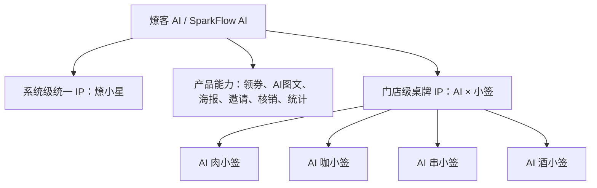

# 01 品牌体系：燎客 AI / SparkFlow AI

## 1.1 品牌最终定名

### 中文主品牌

**燎客 AI**

### 英文品牌名

**SparkFlow AI**

### 不建议使用

**Lock AI**

原因：

- “Lock”更容易让人联想到锁定、安全、加密、门禁，与「点燃客流」无关。
- 和中文「燎客」的火、星火、裂变客流意象不匹配。
- 英文环境里已有较多 Lock / AI Lock / LockedIn AI 类似命名，辨识度弱。

## 1.2 品牌含义

### 燎

来自「星火燎原」。

一位顾客就是一个火种。顾客到店后，通过 AI 生成更愿意分享的图文或海报，把一次堂食体验变成一次自然传播。

### 客

代表顾客、客流、客源。

燎客 AI 的核心不是单纯做一个扫码牌，也不是一个普通 AI 文案工具，而是帮线下门店把到店顾客转化成下一波客流。

## 1.3 品牌定位

> **燎客 AI 是一套为线下餐饮门店打造的桌边 AI 裂变获客系统。**

它通过一块桌边 AI 小签，把「扫码领券、AI 晒圈、邀请新客、私域沉淀」串成一个可复制的增长闭环。

## 1.4 中英文品牌介绍

### 中文完整版

> **燎客 AI · 桌边裂变获客系统**
>
> 燎客 AI 是一套专为线下餐饮门店打造的 AI 裂变获客系统。  
> 它把一块桌边二维码牌，升级成一个能领券、能互动、能生成朋友圈内容、还能带来新客的增长入口。
>
> 顾客扫码后，可以先领取到店福利，再由 AI 小助手引导上传照片、生成高级文案和专属海报。  
> 当顾客自愿分享后，朋友通过海报二维码到店消费，系统可以识别邀请关系，并给老客发放奖励券。
>
> 对商家来说，燎客 AI 不是简单的打折工具，而是一套把到店顾客变成「自来水推广员」的轻量增长系统。

### English Version

> **SparkFlow AI – Table-side Viral Growth for Restaurants**
>
> SparkFlow AI is an AI-powered growth system built for offline restaurants.  
> It turns a simple table tag into an interactive customer acquisition engine: scan, claim a benefit, create AI-powered social content, share voluntarily, and bring new guests back to the store.
>
> With SparkFlow AI, every guest can become a spark.  
> One scan starts the flow, and one shared moment can bring the next table of customers.

## 1.5 Slogan

### 中文主 Slogan

> **燎客 AI——让每一位顾客，都帮你点燃下一位顾客。**

### 中文短版

- 一码点燃新客流
- 让每张餐桌，都变成获客入口
- 把到店顾客，变成自来水
- 不靠硬投流，也能让顾客帮你带顾客

### 英文 Slogan

> **SparkFlow AI – One Scan, Spark Your Flow.**

备选：

- Turn Every Guest into Your Growth Engine.
- One Table Tag, Endless Customer Flow.
- Spark Every Guest. Grow Every Store.

## 1.6 品牌使用规范

### 对商家正式称呼

使用：

- 燎客 AI
- 燎客 AI · 桌边裂变获客系统
- 燎客 AI 餐饮标准版

避免：

- AI扫码打折系统
- 扫码领券平台
- 朋友圈裂变工具

这些说法太工具化，容易降低品牌感。

### 对顾客出现的称呼

顾客端不要频繁出现「裂变」「获客」「私域」这些 B 端词汇。

顾客端应使用：

- 燎小星
- AI 小签
- 今日福利
- AI 朋友圈神器
- 你的专属火锅海报

### 对内部开发称呼

内部可以使用更清晰的模块名：

- Brand：Liaoke AI
- English Brand：SparkFlow AI
- System IP：LiaoXiaoXing
- Store Table IP：AI_X_XiaoQian

## 1.7 品牌层级

