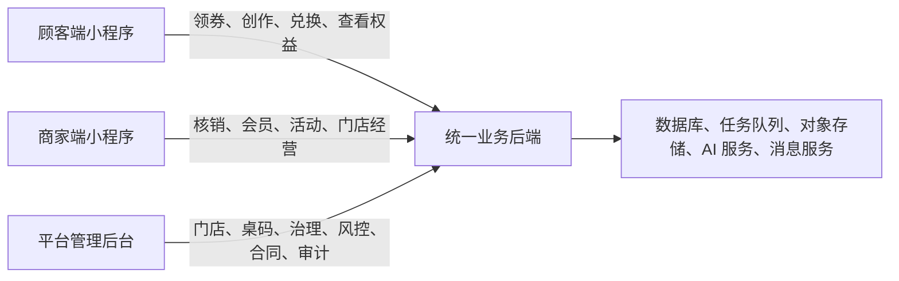
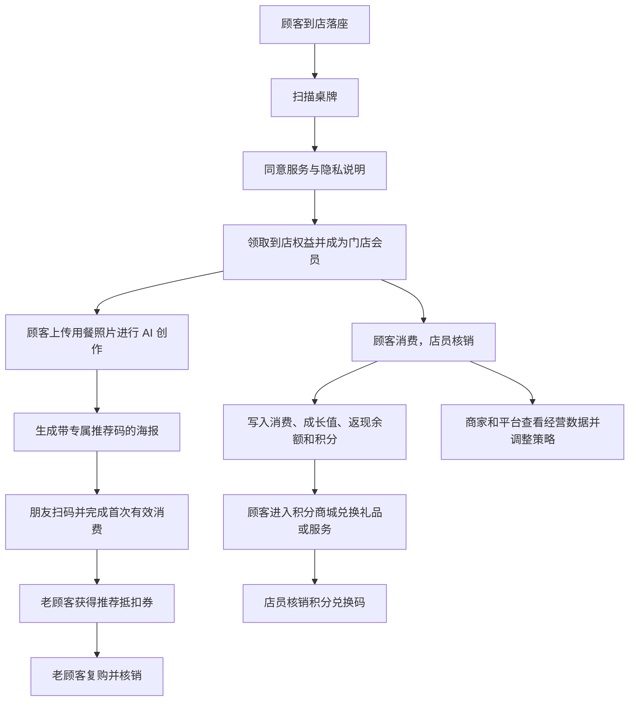

# 燎客全角色系统操作、运营与维护说明书 v3.1.3

> 文档状态：全角色主说明书<br>
> 最后更新：2026-07-15<br>
> 适用对象：顾客、商家店员、店长、商家老板、燎客运营人员、超级管理员、开发与维护人员<br>
> 适用系统：顾客端小程序、商家端小程序、平台管理后台、统一业务后端<br>
> GitHub 源码：[wp746/liaoke-ai](https://github.com/wp746/liaoke-ai)，正式发布分支为 `main`<br>
> 当前评审地址：[https://liaoke-ai.vercel.app](https://liaoke-ai.vercel.app)<br>
> 重要说明：Vercel 页面是三端交互评审原型，不能处理真实顾客、支付、券码或经营数据。

## 0. 如何使用本说明书

### 0.1 按身份快速查找

| 你的身份 | 建议先看 | 平时最常查 |
|---|---|---|
| 顾客 | 第 3 章 | 领券、AI 创作、余额、推荐券、积分和隐私操作 |
| 商家店员 | 第 4.3 至 4.5 节 | 五类核销、异常提示、顾客解释话术 |
| 商家店长 | 第 4 章 | 经营看板、会员、积分商品、核销记录 |
| 商家老板 | 第 4、6、7 章 | 权益策略、员工、成本、活动、日报周报 |
| 燎客运营人员 | 第 5、6、7 章 | 门店上线、玩法配置、风险、续费与运营 SOP |
| 超级管理员 | 第 5 章 | 门店、桌码、积分治理、AI、账号、合同和审计 |
| 开发维护人员 | 第 8 至 10 章 | 架构、环境、测试、发布、监控、故障和数据修复 |

### 0.2 状态标记

本说明书使用以下标记区分能力成熟度：

- **生产规则**：正式系统必须遵守的业务规则。
- **当前原型**：Vercel 三端原型已经可以演示的交互。
- **原生骨架**：`miniprogram/` 已有页面或组件，但仍可能使用 mock 数据。
- **待接生产**：正式使用前必须接入真实 API、数据库、微信能力或监控。
- **推荐做法**：运营建议，不是系统强制值，应结合门店毛利和实际数据调整。

### 0.3 文档优先级

遇到文档冲突时按以下顺序判断：

1. 已签署合同、隐私政策和依法确认的正式规则。
2. `PRD-liaoke-ai-mvp-v3.1-points.md` 中的积分生产规则。
3. `PRD-liaoke-ai-mvp-v3.0.md` 中的非积分业务规则。
4. `standard-mvp/10-api-contract.md` 和 `06-database-schema.sql`。
5. 本说明书中的操作建议。
6. Vercel 原型中的演示数据和文案。

原型中的固定日期、固定券码、固定会员和模拟金额只用于评审，不是生产数据标准。

## 1. 系统总览

### 1.1 燎客是什么

燎客把餐饮门店已经到店的真实顾客，通过桌边扫码沉淀为门店会员，再通过领券、AI 创作、消费返现、一级推荐和积分兑换，形成可持续复购和可复盘经营数据。

它不是单一发券工具，也不是只做海报的 AI 工具，而是一套连接顾客、商家和平台的门店增长系统。

### 1.2 三端关系



三端必须使用同一后端数据源。例如商家修改积分商品后，顾客积分商城应读取同一商品；顾客兑换后，商家核销台应读取同一兑换记录。

### 1.3 系统主闭环



### 1.4 四套价值体系

| 体系 | 解决的问题 | 怎么获得 | 怎么使用 | 关键边界 |
|---|---|---|---|---|
| 成长值 | 会员等级与长期关系 | 有效消费和指定成长行为 | 自动决定等级 | 只升不降，不是钱 |
| 返现余额 | 推动本人复购 | 消费后按比例返还 | 下次消费抵扣 | 不提现、不转让，不等于储值卡 |
| 推荐抵扣券 | 推动一级老带新 | 好友完成首次有效消费后发放 | 老客下次到店抵扣 | 只做一级，不做团队计酬 |
| 积分 | 用低成本礼品提升频次 | 消费、签到、AI 分享、资料、生日 | 换赠品或服务 | 不抵现金、不提现、不转让、不可跨店 |

### 1.5 角色权限总表

| 功能 | 顾客 | 店员 | 店长 | 老板 | 平台运营 | 超级管理员 |
|---|---:|---:|---:|---:|---:|---:|
| 查看本人权益 | 是 | 否 | 否 | 否 | 否 | 否 |
| 顾客兑换积分商品 | 是 | 否 | 否 | 否 | 否 | 否 |
| 核销权益 | 否 | 是 | 是 | 是 | 否 | 否 |
| 查看会员 | 否 | 否 | 是 | 是 | 按授权只读 | 按授权 |
| 修改权益与积分规则 | 否 | 否 | 否 | 是 | 否 | 否 |
| 管理积分商品 | 否 | 否 | 是 | 是 | 否 | 否 |
| 管理员工和门店状态 | 否 | 否 | 否 | 是 | 否 | 否 |
| 查看平台全部门店 | 否 | 否 | 否 | 否 | 是 | 是 |
| 创建门店、桌码和平台账号 | 否 | 否 | 否 | 否 | 否 | 是 |
| 发布积分治理和系统配置 | 否 | 否 | 否 | 否 | 否 | 是 |

后端必须再次校验权限。前端不显示按钮不等于完成安全控制。

## 2. 开始使用前的准备

### 2.1 顾客需要什么

- 一部可以正常使用微信的手机。
- 能访问小程序的移动网络或 Wi-Fi。
- 扫描门店当前桌台的有效二维码。
- 进入时主动同意服务与隐私说明。
- 手机号不是进入前置条件；只有特定权益需要绑定账户时才按需授权。

### 2.2 商家需要什么

- 已由平台创建门店并绑定套餐。
- 老板、店长和店员使用各自独立账号，不共用老板账号。
- 每张桌牌对应正确的 `store_id` 和 `table_id`。
- 返现、推荐、积分和活动规则已经由老板确认。
- 高峰期前至少一台设备完成登录和扫码权限检查。

### 2.3 平台运营需要什么

- 门店合同、套餐、门店名称、城市、品类、人均消费和桌台数量。
- 门店 Logo、品牌色、桌牌 IP 名称和可用图片资产。
- 商家老板的账号绑定信息和门店授权范围。
- 试点目标、数据口径和上线时间。
- 出现风险或故障时的商家联系人和技术联系人。

### 2.4 评审原型与正式系统的区别

| 项目 | Vercel 评审原型 | 正式系统 |
|---|---|---|
| 数据 | 浏览器会话中的演示数据 | 真实 API 和数据库 |
| 登录 | URL 切换角色 | 微信身份、账号和后端权限 |
| 券码 | 固定演示码 | 服务端安全随机码 |
| 支付与订单 | 演示数据 | 真实订单或核销数据 |
| AI | 演示状态流 | 真实模型、审核、降级和配额 |
| 导出 | 演示文件 | 审计后的真实报表 |
| 小程序发布 | 不适用 | 真实 AppID、隐私配置、体验版和正式版 |

任何人都不能把 Vercel 原型当作真实营业工具使用。

## 3. 顾客端操作说明

### 3.1 扫码进入门店

**适用场景**：顾客落座后扫描桌牌。

操作步骤：

1. 打开微信扫一扫，对准桌牌二维码。
2. 确认页面显示的门店名称和桌号与当前门店一致。
3. 阅读服务与隐私说明。
4. 主动勾选同意后进入；勾选框默认不勾选。
5. 如系统提示门店不可用，先不要反复扫码，联系店员确认门店或桌码状态。

正常结果：进入门店首页，显示当前桌号、到店券、积分和 AI 创作入口。

常见问题：

| 现象 | 处理方法 |
|---|---|
| 微信无法识别二维码 | 擦拭桌牌、调整距离和光线，或让店员检查桌码状态 |
| 页面一直加载 | 切换移动网络和 Wi-Fi，退出后重新进入一次 |
| 显示其他门店 | 立即停止操作，让店员记录桌号并联系运营更换桌牌 |
| 显示门店暂停 | 余额和历史通常仍可查看，但新领券或核销可能暂停 |
| 不想授权手机号 | 可以拒绝；进入不应强制手机号，涉及绑定的权益会单独说明 |

### 3.2 首页

首页用于完成三件事：领取当前到店权益、查看积分和进入 AI 创作。

推荐顺序：

1. 先领取今日到店券。
2. 用餐过程中拍摄 1 至 3 张清晰照片进行 AI 创作。
3. 结账前进入权益中心查看可以使用的券或余额。

首页显示的“可用权益数量”和积分应来自服务端，不以截图或口头承诺为准。

### 3.3 领取到店券

操作步骤：

1. 在首页点击“领取今日到店券”。
2. 如该权益要求绑定会员，按页面提示完成必要授权。
3. 等待“领取成功”提示。
4. 点击“先查看权益”进入权益中心，或自愿选择加入门店福利群。

系统规则：

- 同一活动、同一顾客的领取次数受活动规则限制。
- 券是否可用取决于状态、有效期、门店、最低消费和叠加规则。
- 已领取时按钮显示“今日到店券已领取”，重复点击不应重复发券。

不要做：不要把券码截图长期转发给他人。正式系统会校验本人、门店、状态和有效期。

### 3.4 加入门店会员福利群

领券成功后，顾客会看到“加入门店福利群”和“先查看权益”两个选择。入群是额外服务，不是领券条件；选择不加入或之后退群，都不影响已经领取的券、余额、积分和会员等级。

可从三处进入：

1. 领券成功页点击“加入门店福利群”。
2. 首页点击“加入会员福利群”。
3. 个人中心的“我的服务”中点击“加入会员福利群”。

入群操作：

1. 先阅读群名称、群内福利和消息说明，确认是当前门店。
2. 点击二维码放大，在微信中长按识别；也可点击打开或复制入群链接。
3. 二维码失效、群已满或无法识别时，点击“联系群助手”。
4. 微信展示群信息后，由顾客本人确认加入。
5. 入群后先阅读欢迎语和群公告，优惠以小程序和系统券状态为准。

安全提醒：

- 企业微信群不会要求提供支付密码、短信验证码、身份证照片或银行卡完整信息。
- 不要把群二维码转发到无关公共渠道，以免大量无关账号进入。
- 群内消息、口头承诺或截图不能代替正式券码和系统核销。
- 群消息过多时可以关闭提醒或退群，既有权益不受影响。

常见问题：

| 现象 | 处理方法 |
|---|---|
| 二维码无法识别 | 点击放大、提高屏幕亮度，或保存后从相册识别 |
| 提示二维码过期 | 点击联系群助手，由门店提供最新活码 |
| 群已满 | 联系群助手加入下一群，不要反复扫描旧码 |
| 点击入口没有反应 | 复制链接后在微信打开，仍失败则联系门店 |
| 不想入群 | 直接选择“先查看权益”，不影响任何已领权益 |

### 3.5 权益中心

权益中心分为：

- **到店券**：门店活动发放的优惠券。
- **推荐券**：好友完成有效首单后给推荐人的抵扣券。
- **返现余额**：消费后获得、下次可抵扣的门店余额。

查看券详情：

1. 进入“权益”。
2. 选择对应分类。
3. 点击券卡片。
4. 查看状态、有效期、适用门店和使用限制。
5. 到收银或结账前出示券码。

券状态说明：

| 状态 | 含义 | 能否核销 |
|---|---|---:|
| 可使用 `active` | 已生效且未过期 | 是 |
| 待生效 `pending` | 条件已满足但未到生效时间 | 否 |
| 已使用 `used` | 已完成核销 | 否 |
| 已过期 `expired` | 超过有效期 | 否 |
| 已取消 `cancelled` | 因退款、风控或人工处理取消 | 否 |

### 3.6 返现余额和抵扣码

查看与使用：

1. 进入“权益”并选择“返现余额”，或从个人中心进入余额页。
2. 查看当前可用余额和明细。
3. 结账前点击“生成抵扣码”。
4. 将二维码或短码交给店员。
5. 店员核对订单和可抵扣金额后确认核销。
6. 顾客查看核销结果和余额变化。

重要边界：

- 返现余额只能按门店规则用于消费抵扣。
- 不可提现、转让或跨店通用。
- 可抵扣比例和有效期以门店当前规则及余额流水快照为准。
- 对余额有异议时，先查流水，不要只比较当前余额。

### 3.7 AI 创作

**目的**：把顾客真实用餐照片生成适合分享的文案和海报，并带上本人专属推荐码。

操作步骤：

1. 点击底部“AI 创作”。
2. 上传 1 至 3 张清晰的用餐照片。
3. 输入不超过 50 字的真实感受。
4. 选择“烟火食刻、质感大片、漫画趣味、简约清新”之一。
5. 点击“生成我的海报”。
6. 等待文案和图片处理。
7. 从候选文案中选择最符合自己的版本。
8. 预览海报，保存图片或复制文案。
9. 自愿分享，不强制发布朋友圈。

拍摄建议：

- 菜品占画面主体，避免完全逆光。
- 1 张菜品特写、1 张桌面氛围、1 张朋友互动通常比三张重复菜图更好。
- 感受应具体，例如“吊龙很嫩，朋友聚餐很舒服”，不要只写“很好吃”。
- 不上传身份证、银行卡、聊天记录或其他敏感图片。

结果状态：

| 状态 | 系统表现 | 顾客怎么做 |
|---|---|---|
| 正常生成 | 提供文案候选和海报 | 选择、保存或重新生成 |
| 图片生成失败 | 降级为文案版或模板海报 | 可以继续使用，也可重试 |
| 内容不合规 | 提示更换照片 | 更换清晰、合规的用餐照片 |
| 长时间处理中 | 展示任务状态 | 不要连续重复提交，稍后查看任务结果 |

### 3.8 专属推荐和推荐券

推荐链路：

1. 老顾客生成带专属推荐码的海报。
2. 朋友扫描推荐码进入同一门店。
3. 系统绑定一级推荐关系。
4. 朋友完成首次符合条件的消费并核销。
5. 老顾客获得推荐抵扣券。
6. 推荐券按规则进入待生效、可使用、已使用或已过期状态。

生产规则：

- 只记录直接推荐的一层关系。
- 自己不能邀请自己。
- 同一新顾客不能被多个推荐人重复绑定。
- 分享本身不直接产生现金返利；有效消费后才触发推荐权益。
- 推荐券不可提现或转让。

推荐进度页用于查看“已绑定、首消完成、待生效、可使用、已完成”等节点。若朋友已经消费但进度未更新，先确认是否在同一门店、是否为首次有效消费、订单是否完成核销。

### 3.9 我的积分

积分可能来自：

- 消费。
- 每日到店签到。
- AI 晒圈成功。
- 自愿完善资料。
- 生日当月到店消费。

查看积分：

1. 点击底部“积分”或个人中心的“我的积分”。
2. 查看当前积分。
3. 查看每一笔增加、扣减和发生时间。
4. 如有到期提醒，优先使用即将到期的积分。

积分不是钱，不可抵现金、提现、转让或跨店使用。

### 3.10 积分商城和兑换

操作步骤：

1. 进入“积分商城”。
2. 按热门、饮品、小菜、小吃或服务筛选。
3. 查看商品积分价、库存和本月限兑次数。
4. 点击商品查看详情和使用说明。
5. 确认积分消耗和有效期。
6. 点击确认兑换。
7. 兑换成功后保存兑换短码或二维码。
8. 到店向店员出示，店员确认已交付赠品后核销。

不能兑换的常见原因：

| 提示 | 原因 | 处理 |
|---|---|---|
| 平台已暂停积分功能 | 平台总开关关闭 | 等待恢复，余额和历史不受影响 |
| 本店已暂停积分功能 | 门店开关关闭 | 咨询商家，余额和历史不受影响 |
| 商品已下架 | 商家停止新兑换 | 选择其他商品；已有有效码仍按规则处理 |
| 已售罄 | 当前库存为 0 | 等待补货或选择其他商品 |
| 本月限兑次数已用完 | 达到单商品月限 | 下月再兑换或选择其他商品 |
| 积分不足 | 当前积分小于积分价 | 继续积累积分 |

兑换确认后积分和库存立即扣减。P0 版本兑换码过期不自动退积分，因此确认前必须看清有效期和使用限制。

### 3.11 会员等级和成长值

在“我的”进入“会员等级”可查看：

- 当前等级。
- 当前成长值和下一等级门槛。
- 已解锁权益。
- 距离升级还差多少成长值。

成长值用于等级判断，不等于积分，也不能兑换或抵扣。退款、异常订单和等级调整以正式规则为准。

### 3.12 隐私与数据权利

在“我的 > 隐私与数据权利”可发起：

- 查询个人数据。
- 导出个人数据。
- 删除可删除的个人数据。
- 撤回隐私同意。
- 注销账户。

正式系统处理这些申请时必须进行身份校验，并告知处理范围、预计时间和不可删除的法定留存数据。撤回同意或注销可能导致积分、券、余额和个性化服务无法继续使用，确认前应展示明确后果。

### 3.13 顾客常见问题

| 问题 | 建议处理 |
|---|---|
| 领券后找不到 | 进入权益中心查看到店券；仍没有时确认是否切换了门店 |
| 券显示待生效 | 等到生效时间，不要让店员人工绕过状态 |
| 朋友消费了但没有推荐券 | 确认首次消费、同一门店、推荐关系和订单核销状态 |
| 余额少了 | 查看余额流水和最近抵扣记录 |
| 积分没到账 | 确认行为是否满足规则、是否已发过、门店是否暂停 |
| 积分兑换后没库存 | 兑换时已经预占库存，向店员出示有效兑换码 |
| 店员说码已使用 | 查看首次核销时间，要求门店按记录核对，不要再次核销 |
| AI 一直失败 | 更换清晰照片，减少到 1 至 3 张，稍后重试 |
| 不想继续使用 | 在隐私与数据权利中撤回同意或提交注销申请 |

## 4. 商家端操作说明

### 4.1 三类商家角色

| 角色 | 主要职责 | 不应拥有的权限 |
|---|---|---|
| 老板 | 经营策略、规则、员工、门店、套餐、导出 | 无需参与每笔日常核销 |
| 店长 | 今日经营、会员、积分商品、核销和现场管理 | 不得修改返现、推荐和积分发放规则 |
| 店员 | 扫码引导和五类核销 | 不得查看经营配置、会员敏感资料或导出数据 |

推荐做法：每人使用自己的账号。不要多人共用店员账号，否则无法追查误核销和异常操作。

### 4.2 登录与今日经营

登录后系统根据角色进入：

- 老板、店长进入“今日经营”。
- 店员进入“核销工作台”。

今日经营七项指标：

| 指标 | 说明 | 运营判断 |
|---|---|---|
| 今日扫码 | 扫描有效桌码的去重人数或次数，口径上线前锁定 | 低于历史均值先查桌牌和店员引导 |
| 到店券领取 | 成功领券人数 | 扫码高但领取低，检查权益吸引力和授权摩擦 |
| 今日新会员 | 新增门店会员 | 用于判断到店沉淀能力 |
| AI 海报用户 | 完成 AI 创作的人数 | 判断分享玩法是否被顾客接受 |
| 老带新订单 | 有有效推荐关系的新客订单 | 判断裂变是否转成真实消费 |
| 预估新增营业额 | 按已确认口径估算 | 仅用于经营参考，不能代替财务收入 |
| 入群点击 | 顾客主动点击入群通道的次数或去重人数 | 只代表入群意向，不等于实际入群人数 |

老板或店长每天先看趋势，再看成本和异常，不要只看单日总数。

### 4.3 高峰期核销准备

开餐前 10 分钟检查：

- 商家账号已登录且角色正确。
- 摄像头权限正常。
- 网络稳定，备用设备可用。
- 门店状态为正常营业。
- 核销工作台显示服务正常。
- 当日活动、券门槛和积分商品交付内容已向店员说明。

高峰期原则：先扫描和预检，再看清权益和应收金额，最后确认。不要因为排队直接跳过核对。

### 4.4 通用核销流程

所有核销都按以下步骤：

1. 顾客打开对应权益二维码或短码。
2. 店员在核销工作台选择正确类型。
3. 扫码；反光或摄像头异常时改用手动输入。
4. 系统查询并展示权益内容、状态、门店和限制。
5. 店员与顾客核对。
6. 涉及订单金额时确认最低消费和实际应收。
7. 点击确认核销。
8. 等待明确的成功或失败结果。
9. 只有显示“核销成功”才交付权益或完成抵扣。

不要以顾客截图、口头说明或聊天记录代替系统核销结果。

### 4.5 五类核销

#### 4.5.1 到店券扫码核销

1. 选择“扫码核销”。
2. 扫描顾客到店券。
3. 查看券名、面值、门店、有效期、最低消费和叠加限制。
4. 输入或确认订单实付条件。
5. 点击“确认核销”。

#### 4.5.2 手动核销

适用于屏幕反光、摄像头故障或二维码损坏：

1. 选择“手动核销”。
2. 让顾客读出完整短码。
3. 输入英文和数字，检查是否有 `0/O`、`1/I` 混淆。
4. 点击“查询权益”。
5. 核对后确认。

手动输入不是绕过校验，仍需服务端验证全部规则。

#### 4.5.3 余额核销

1. 选择“余额核销”。
2. 扫描顾客即时生成的余额抵扣码。
3. 输入或确认本单符合抵扣条件的实付金额。
4. 查看系统计算的最大可抵扣金额。
5. 与收银系统金额一致后确认。

严禁手工把余额当现金返给顾客。

#### 4.5.4 推荐券核销

1. 选择“推荐券核销”。
2. 扫描顾客推荐券。
3. 检查状态是否可使用、是否本店、是否达到最低消费。
4. 核对券面值和应收金额。
5. 确认核销。

按钮统一叫“推荐券核销”，顾客解释时可说“朋友消费后获得的推荐抵扣券”。

#### 4.5.5 积分兑换核销

1. 选择“积分兑换核销”。
2. 扫描顾客兑换码。
3. 查看礼品或服务名称、兑换门店和状态。
4. 先确认门店可以交付对应商品。
5. 将赠品交给顾客或完成服务。
6. 点击“确认已交付赠品”。

积分和库存已在顾客兑换时扣除，核销时不再次扣积分或库存。

### 4.6 核销结果与异常处理

| 提示 | 含义 | 现场处理 |
|---|---|---|
| 核销成功 | 已写入记录 | 完成交付并继续下一单 |
| 该兑换码已使用 | 曾成功核销 | 查看首次核销人和时间，不重复交付 |
| 非本门店权益 | 门店不匹配 | 告知顾客前往原门店，禁止跨店人工放行 |
| 权益暂未生效 | 仍是待生效 | 告知可用时间，不手工改状态 |
| 未满足最低消费 | 订单金额不足 | 按规则结算或放弃使用 |
| 兑换码已过期 | 超过有效期 | 不核销；是否补偿由老板或运营决定 |
| 查询超时 | 结果未知 | 先按请求号查询最终状态，再决定是否重试 |
| 服务异常 | 后端或网络故障 | 不连续点击，记录码、时间和设备并升级处理 |

查询超时时最危险的做法是立刻重复核销。必须先查询原请求结果，避免重复扣减。

### 4.7 核销记录

- 老板可查看全店核销。
- 店长和店员默认只查看权限范围内或本人相关记录。
- 记录应包含权益类型、券码、核销结果、核销人、角色、门店、时间和请求 ID。
- 对账时以服务端成功记录为准，不以顾客页面动画为准。

发现可疑记录时先保留证据，不要直接删除。记录桌号、订单号、券码、操作人和时间后提交平台复核。

### 4.8 会员管理

会员列表支持按昵称、手机号后四位、等级、最近到店和推荐人数筛选。

推荐使用场景：

- 查找最近 30 天未到店的高等级会员。
- 查找有推荐记录但近期未复购的会员。
- 查找生日会员，安排关怀活动。
- 查找积分较高但长期未兑换的会员。

会员 360 度详情可查看基本资料、等级成长、消费、AI 使用、当前权益、积分和推荐券记录。

隐私要求：

- 只展示完成工作所需信息。
- 手机号默认脱敏。
- 不允许把会员数据私自导入个人通讯录、群发工具或交给其他门店。
- 店员原则上不访问完整会员详情。

### 4.9 活动模板与玩法

当前活动模板：

| 模板 | 目的 | 推荐使用 |
|---|---|---|
| 老带新奖励 | 让老客带真实新客 | 长期常驻，但要控制面值和月限 |
| 生日礼 | 提升会员关怀和生日到店 | 每月提前筛选生日会员 |
| 工作日福利 | 填补周一至周四淡时段 | 仅限明确时段，避免周末无效让利 |
| 好友首单礼 | 降低新客首次到店门槛 | 与推荐海报联动，首单完成后触发 |

发布活动：

1. 老板进入“运营 > 活动列表”。
2. 选择模板。
3. 检查活动标题和配置说明。
4. 确认适用时间、对象、门槛、上限和成本。
5. 发布活动。
6. 在顾客端测试文案、领券和核销。

推荐做法：同一周期只突出一个主活动。活动越多不等于效果越好，叠加过多会让店员和顾客都无法判断该用什么。

### 4.10 返现与推荐策略

只有老板可以修改。保存后只影响新发放权益，历史权益保留原规则。

| 字段 | 系统范围 | 标准建议 | 说明 |
|---|---:|---:|---|
| 消费返现比例 | 3%-15% | 6%-8% | 毛利低的门店从 3%-5% 开始 |
| 推荐券面值 | 5-20 元 | 10 元 | 应与客单价和最低消费匹配 |
| 推荐券有效期 | 30/45/60 天 | 30 天 | 高频门店 30 天，低频正餐可 45 天 |
| 每人每月领取上限 | 1-20 张 | 5-10 张 | 防止少数用户集中薅取 |
| 新客首单券面值 | 0-30 元 | 5-10 元 | 不应与推荐券和返现同时过度叠加 |
| 成本预警阈值 | 1%-100% | 10%-12% | 按权益实际成本率监控，不按券面额简单相加 |

保存前检查：

- 返现、券和积分的综合成本是否可承受。
- 使用门槛是否高于券面值并符合客单价。
- 店员是否知道活动变化。
- 顾客端规则文案是否同步。

### 4.11 积分规则

平台定边界，老板在边界内设置，店长只读，店员不可见。

当前平台默认值：

| 行为 | 默认积分 | 平台上限 |
|---|---:|---:|
| 每实付 1 元 | 10 | 20 |
| 每日签到 | 5 | 20 |
| AI 晒圈成功 | 50 | 100 |
| 完善资料 | 100 | 300 |
| 生日当月到店 | 200 | 500 |

积分有效期可选 90、180、365 天或永久，默认 365 天。

操作步骤：

1. 老板进入“运营 > 积分规则”。
2. 确认平台是否启用积分功能。
3. 设置本店开关和各项积分值。
4. 选择有效期。
5. 检查是否超出平台上限。
6. 保存。
7. 用顾客账号验证积分规则摘要和商城状态。

某项设置为 0 表示不奖励该行为。关闭本店积分后，顾客仍可查看余额和历史，但不能新获得或新兑换；已有有效兑换码按生产规则仍可核销。

### 4.12 私域会员群配置与运营

控制权：商家老板负责群配置和日常经营；店长可以查看配置与转化数据；店员默认不能进入配置页。平台提供能力、审计和风险治理，不代替商家运营具体微信群。

配置步骤：

1. 老板进入“活动与玩法 > 配置私域福利群”。
2. 先关闭入口或在测试门店操作，避免顾客扫描到半成品。
3. 填写群名称，建议使用“门店名 + 会员福利 + 群序号”。
4. 填写不超过 60 字的福利说明，只承诺能稳定兑现的内容。
5. 填写企业微信群 HTTPS 入群链接并上传群活码。
6. 设置活码有效期，到期前至少 7 天更换。
7. 配置群助手名称和欢迎语。
8. 保存后用顾客账号测试领券成功、首页、个人中心三个入口。
9. 确认二维码、链接、群助手和退群说明都正常后再启用。

推荐福利结构：隐藏券、生日月关怀、新品试吃、工作日午市提醒。不要把所有优惠都放进群，也不要承诺长期无法承受的免费赠品。

转化数据解释：

| 指标 | 含义 | 不能误解为 |
|---|---|---|
| 群页访问 | 打开福利群页 | 已加入 |
| 入群点击 | 点击入群通道 | 已加入 |
| 链接复制 | 复制入群链接 | 已打开或已加入 |
| 助手求助 | 群满或入口异常时求助 | 已解决 |
| 确认入群 | 企业微信可信回调或人工核验 | 永久留存 |

经营建议：

- 每周发 2 至 4 次有价值的信息，60% 为明确福利，25% 为门店内容，15% 为互动关怀。
- 每条优惠都写明适用门店、日期、门槛、库存和叠加规则。
- 第一群接近容量上限时提前准备第二群，不等旧群满后再处理。
- 入群率低时先检查活码是否有效、群是否已满、福利是否具体，再调整入口文案。
- 不使用老板或员工个人微信长期承接核心私域资产。
- 顾客拒绝时停止劝说；店员可说：“不加也不影响这张券。”

### 4.13 积分商品

老板和店长可以管理商品。

创建步骤：

1. 进入“积分商品”。
2. 点击“新建积分商品”。
3. 填写商品名称和图片。
4. 选择饮品、小菜、小吃或服务。
5. 设置积分价，必须在平台 100 至 5000 分范围内。
6. 设置库存，0 表示售罄。
7. 设置每人每月上限，不能超过平台上限 5 次。
8. 设置上架或下架。
9. 保存后到顾客端确认。

推荐商品组合：

- 1 个容易兑换的低门槛商品，例如饮料。
- 1 至 2 个核心菜品或小吃。
- 1 个几乎没有直接成本的服务型权益，例如优先排队。
- 1 个较高积分的目标商品，给高活跃会员持续积累理由。

不要把库存填成虚假大数。生产系统应使用真实库存或明确的无限库存模式。

### 4.14 员工与权限

只有老板可以：

- 添加员工。
- 将员工设为店长或店员。
- 修改非老板账号角色。
- 移除员工。

老板账号受保护，不能通过普通员工管理操作移除或降级。

员工离职处理：

1. 当班结束后立即停用账号。
2. 回收登录设备和相关物料。
3. 检查最近核销和导出记录。
4. 必要时让平台撤销登录会话。
5. 保留历史操作人，不删除审计记录。

### 4.15 门店暂停与恢复

只有老板可以暂停或恢复门店。

适用场景：临时停业、装修、系统故障、重大风险或需要阻止继续领券核销。

暂停前：

- 确认暂停原因和预计恢复时间。
- 告知当班店员和平台运营。
- 记录未完成订单和待交付积分兑换。

暂停后：

- 顾客不能继续领取或核销新权益。
- 返现余额有效期按正式规则顺延。
- 历史数据保留。
- 恢复前必须完成一次顾客端和商家端冒烟测试。

### 4.16 套餐、续费和升级

- 老板可查看、续费和升级。
- 店长可查看但不能付费。
- 店员不应看到套餐经营信息。

续费前不要只看总扫码数，应一起看新增会员、有效核销、老带新订单、积分兑换、权益成本和商家执行度。

### 4.17 数据导出

只有老板可以生成：

- 会员列表。
- 活动报表。
- 月度经营总表。

任务状态：排队中、生成中、可下载、生成失败。

导出要求：

- 选择正确门店和报表周期。
- 只导出完成经营工作所需字段。
- 下载后存放在公司批准的位置，不通过私人聊天工具长期传播。
- 生成失败时使用原任务重试，不重复创建大量任务。
- 平台保留导出人、范围、时间和文件状态审计。

### 4.18 商家每日、每周、每月 SOP

**每日开餐前**：

- 检查门店状态、核销设备、桌牌和网络。
- 告知店员当日主活动和核销规则。
- 检查积分礼品库存。
- 检查群活码、群容量和群助手是否可用。

**每日闭店后**：

- 对照收银记录检查核销数量。
- 查看重复、跨店、超时和异常核销。
- 检查权益成本是否接近预警线。
- 记录顾客投诉和店员操作问题。

**每周**：

- 查看 7 天和 30 天趋势。
- 比较扫码、领券、AI 创作、老带新和积分兑换漏斗。
- 比较群页访问、入群点击、确认入群和群内券核销漏斗。
- 只调整一个主要变量并记录修改时间。
- 复盘低活跃会员和生日会员。

**每月**：

- 导出经营总表。
- 计算综合权益实际成本率。
- 评估活动是否带来真实新客和复购。
- 检查员工权限、套餐到期和积分商品库存。

### 4.19 店员标准话术与红线

推荐引导话术：

> 扫这个码有券，还能 AI 帮你做朋友圈大片。

领券后可补充：

> 券已经到账，愿意的话可以进会员群，隐藏券和生日礼会在群里发，不加也不影响这张券。

顾客拒绝时只说“随时可以扫”，不要继续施压。

店员红线：

- 不替顾客勾选隐私同意或手机号授权。
- 不使用自己或家人账号制造虚假核销。
- 不凭截图、口头承诺或聊天记录交付权益。
- 不承诺余额或积分可以提现。
- 不私自修改顾客数据或导出会员名单。
- 不在结果未知时连续重复核销。

### 4.20 商家常见问题

| 问题 | 处理建议 |
|---|---|
| 扫码人数低 | 查桌牌位置、二维码状态、店员话术和网络，再做文案 A/B 测试 |
| 领券高但核销低 | 查券门槛、有效期、顾客是否知道入口和店员是否主动提醒 |
| AI 使用低 | 检查入口是否突出，店员是否在顾客拍菜时顺势引导 |
| 老带新少 | 检查海报分享率、新客绑定和首次消费核销是否完整 |
| 入群点击低 | 检查领券后引导、群福利是否具体、首页入口和店员一句话说明 |
| 点击高但确认入群低 | 检查活码过期、群满、链接错误和群助手响应；不要把点击当入群 |
| 权益成本高 | 降低返现或券面值、缩短有效期、提高门槛、减少叠加 |
| 积分商品兑换太快 | 提高积分价、降低月限、增加服务型商品，不直接关闭整个积分体系 |
| 店员误核销 | 立即记录订单和券码，联系老板与平台；P0 不自行修改数据库 |
| 报表生成失败 | 重试原任务；持续失败时提交任务 ID 给平台 |
| 门店需要临时停业 | 老板使用门店暂停，并告知平台和顾客恢复时间 |

## 5. 平台运营与管理后台操作说明

### 5.1 平台角色

| 角色 | 能力 | 使用原则 |
|---|---|---|
| 平台运营管理员 `platform_admin` | 跨门店只读查看 | 用于日常巡检、客户成功和问题定位 |
| 超级管理员 `super_admin` | 创建、编辑、发布、停用和审计操作 | 仅少数受控账号使用，重要操作必须留痕 |

平台运营人员不能为了方便借用超级管理员账号。需要写操作时，应提交操作原因、目标对象和预期结果，由超级管理员执行或临时授权。

### 5.2 登录和平台总览

平台总览用于判断全局经营和风险，不用于替代单店明细。

当前核心指标：

- 在线门店。
- 今日扫码。
- 新增会员。
- AI 任务成功率。
- 30 日增长趋势。
- 风险队列。
- 重点门店。

推荐巡检顺序：

1. 先看是否有高风险事件。
2. 看在线门店和 AI 成功率是否突然下降。
3. 看 30 日趋势是否出现断崖式变化。
4. 打开风险最高或变化最大的门店。
5. 对照该店桌码、核销、活动、AI 和套餐状态。

### 5.3 门店管理

#### 5.3.1 查找门店

1. 进入“门店列表”。
2. 输入门店名称、ID 或城市。
3. 按营业中、暂停或停用筛选。
4. 打开门店 360 度详情。

平台默认按风险数量从高到低排序，避免低风险门店占据处理时间。

#### 5.3.2 创建门店

只有超级管理员可以创建。

必填或关键字段：

- 门店名称。
- 门店类型。
- 桌牌 IP 名称。
- 人均消费。
- SaaS 套餐。
- 门店状态。
- 品牌 Logo。
- 品牌主色。
- 城市和经营信息。

创建前检查：

- 合同或试点审批已完成。
- 门店名称和收款主体一致。
- 门店 ID、城市、品类和套餐无重复或误绑。
- 已确定顾客权益和积分默认规则。
- 已指定商家老板和平台客户成功负责人。

创建后不要立刻印刷桌牌，应先生成测试桌码走通顾客领券和商家核销。

#### 5.3.3 编辑和停用门店

- 编辑前记录变更原因。
- 套餐、状态、品牌和经营参数变化应写审计日志。
- “暂停”用于临时停止营业；“停用”用于终止服务或严重风险，影响更大。
- 停用前必须评估未使用券、余额、积分和数据导出安排。

### 5.4 单店 360 度详情

单店详情用于查看：

- 会员数量。
- 有效桌码。
- 本月到店。
- 权益成本率。
- 当前套餐。
- AI 配额使用。
- 最近活跃。
- 客单价。
- 风险信号。

处理问题时，不要只看某一个数字。例如核销突然上升，可能是活动有效，也可能是员工重复操作；要结合扫码、会员、订单、核销人和风险记录判断。

### 5.5 桌码中心

功能包括批量生成、选择下载和停用桌码。

生成步骤：

1. 先确认当前选中的门店。
2. 输入数量，单次建议不超过实际桌数；系统上限 50。
3. 点击“批量生成桌码”。
4. 核对桌号、桌码 ID 和状态。
5. 选择需要的桌码并下载。
6. 印刷前用测试环境扫描抽检。

桌码摆放建议：

- 一桌一码，不能跨桌复制同一图片。
- 放在顾客落座后自然视线范围，不被菜单、纸巾或调料遮挡。
- 物料上同时出现明确利益和 AI 好奇点。
- 油污、破损或门店迁移后及时更换。

停用桌码：

1. 确认门店和桌号。
2. 点击停用。
3. 阅读影响提示。
4. 确认停用。
5. 现场移除对应实体桌牌。

停用操作必须可审计。不要只停用系统码却保留桌上旧物料。

### 5.6 权益预设模板

平台模板用于给新门店提供起点，不代表所有门店都要使用相同活动。

当前模板包括到店券、返现、推荐奖励和积分预设。

使用原则：

- 模板变更默认只影响之后采用模板的新配置。
- 暂停模板前先检查是否有正在创建的门店依赖它。
- 模板规则必须与 PRD、接口默认值和运营话术一致。
- 当前积分正式默认值为每实付 1 元 10 积分。

### 5.7 积分治理

积分治理由超级管理员发布，平台运营管理员只读。

#### 5.7.1 全平台开关

关闭适用于：严重积分异常、规则漏洞、批量超发、兑换安全风险或重大维护。

关闭后：

- 停止新积分发放和新兑换。
- 保留门店规则、商品、余额和历史流水。
- 暂停前已经生成且仍有效的兑换码允许按生产规则核销。
- 门店不能自行绕过平台开关。

#### 5.7.2 新门店默认规则

| 配置 | 默认值 |
|---|---:|
| 每实付 1 元 | 10 积分 |
| 每日签到 | 5 积分 |
| AI 晒圈 | 50 积分 |
| 完善资料 | 100 积分 |
| 生日当月到店 | 200 积分 |
| 有效期 | 365 天 |

#### 5.7.3 商家调整边界

| 配置 | 平台边界 |
|---|---:|
| 每实付 1 元积分上限 | 20 |
| 每日签到积分上限 | 20 |
| AI 晒圈积分上限 | 100 |
| 完善资料积分上限 | 300 |
| 生日奖励积分上限 | 500 |
| 商品积分价 | 100-5000 |
| 每人每月单商品限兑 | 最多 5 次 |

发布前校验：

- 默认值不得高于对应上限。
- 商品最低积分不得高于最高积分。
- 月限不得小于 1。
- 数值必须是非负整数。
- 有效期只能是 90、180、365 天或永久。

每次发布都应生成版本和审计记录。修改默认值只影响新门店，不能静默覆盖存量门店已确认的规则。

### 5.8 私域群治理与巡检

平台的职责是管理能力和风险，不是代替商家发群消息。平台运营管理员只读巡检；超级管理员只在商家授权纠错、重大风险或应急处置时修改或停用入口。

跨店巡检指标：

- 开启私域群入口的门店数和占比。
- 群页访问、入群点击、确认入群和私域沉淀率。
- 活码 7 天内到期、已过期和入口异常门店。
- 群助手求助量和长时间未解决门店。
- 群内券核销、投诉、退群和风险事件。

巡检步骤：

1. 先查活码过期、群满和异常高点击低确认门店。
2. 打开单店配置，核对群名称、链接、活码、有效期和负责人。
3. 检查商家是否把入群作为领券前置条件，或使用误导承诺。
4. 通知商家老板在限定时间内整改，并保留沟通和配置审计。
5. 遇到诈骗、违法营销、数据泄露或大量投诉时，超级管理员可停用入口。
6. 风险解除后由商家重新提交配置，真机验证后恢复。

平台报表必须把“入群点击”和“确认入群”分开。未接企业微信可信回调的门店只能展示意向指标，不能对外宣称私域沉淀人数。

### 5.9 AI 配额和失败任务

AI 配额页用于查看门店已用次数、预算、成本和使用率。

调整预算前判断：

- 使用增长是否来自真实顾客，而不是重复调用。
- AI 成功率和降级率是否正常。
- 门店套餐是否支持更高预算。
- 单次成本是否突然变化。
- 是否有失败任务在反复重试。

失败任务处理：

1. 打开任务详情。
2. 查看门店、任务类型、发生时间和失败原因。
3. 判断是内容拒绝、上游超时、配额、网络还是内部错误。
4. 能安全重试时由超级管理员明确点击重试。
5. 内容违规任务不能通过反复重试绕过审核。
6. 连续失败应暂停自动重试并通知开发。

### 5.10 提示词版本和关键词

提示词版本状态：草稿、生效中、已退役。

发布流程：

1. 从当前生效版本复制草稿。
2. 修改后在测试门店验证正常、降级和拒绝场景。
3. 检查品牌词、门店词、禁用词和输出长度。
4. 记录变更原因、测试样本和负责人。
5. 发布新版本。
6. 保留旧版本用于回滚，不直接覆盖。

门店关键词用于增强门店特色，禁用词用于所有生成任务前拦截。不要把顾客个人信息写入提示词或关键词库。

### 5.11 风险中心

风险中心集中处理异常核销、异常积分、AI 内容、导出、账号和门店经营风险。

建议分级：

| 级别 | 示例 | 处理时限建议 |
|---|---|---|
| 高 | 批量超发、跨店核销漏洞、账号失控、数据泄露疑似事件 | 立即暂停相关能力并升级 |
| 中 | 单店核销频率异常、AI 失败持续超阈值、权益成本突然上升 | 当日复核 |
| 低 | 单个任务失败、单桌码损坏、偶发导出失败 | 下一个工作日处理 |

处理步骤：

1. 保留原始日志和请求 ID。
2. 判断影响门店、用户、金额和时间范围。
3. 必要时使用最小范围开关止损。
4. 定位原因并验证修复。
5. 对受影响数据做可审计补偿或冲正。
6. 记录复盘和预防措施。

### 5.12 合同、套餐与续费

平台记录门店套餐、合同开始和结束日期、续费状态、负责人和金额。

运营建议：

- 到期前 45 天检查交付和经营数据。
- 到期前 30 天向商家提供月度或阶段报告。
- 到期前 15 天确认续费方案和开票信息。
- 到期前 7 天完成付款或明确停用安排。

续费报告至少包含扫码、会员、核销、AI、老带新、积分兑换、权益成本和门店执行情况，不能只展示乐观指标。

### 5.13 数据导出审计

平台导出审计应记录：

- 谁导出。
- 从哪个门店导出。
- 导出什么类型和时间范围。
- 导出任务状态。
- 文件何时生成、下载和过期。
- 是否包含敏感字段。

异常大量导出、非工作时间导出或离职前集中导出应触发复核。

### 5.14 平台账号

账号管理原则：

- 超级管理员数量最小化。
- 平台运营默认只读。
- 每人独立账号并启用多因素认证时优先启用。
- 离职或岗位变化当天处理权限。
- 定期检查长期未登录和异常设备。
- 重要操作不允许共享账号。

### 5.15 系统日志与任务

日志用于解释“谁在什么时候对什么做了什么”，不能只记录“操作成功”。

至少包括：

- 门店和桌码操作。
- 平台治理发布。
- 商家规则和活动变更。
- 券、余额、积分发放与核销。
- 人工调整、退款和冲正。
- AI 任务、降级和失败。
- 数据导出和下载。
- 账号登录、角色和权限变更。
- 定时任务开始、结果和失败原因。

### 5.16 新门店三天上线 SOP

**第 1 天：确认经营规则**

- 确认门店、品类、人均消费、桌数和联系人。
- 确认返现、推荐券、新客券、积分和成本预警。
- 确认数据口径和试点目标。
- 完成书面确认。

**第 2 天：创建和测试**

- 创建门店和老板账号。
- 生成测试桌码。
- 配置模板、活动、积分商品和 AI 关键词。
- 走通顾客领券、AI、推荐、余额、积分和商家核销。
- 确认桌牌物料后再批量生成。

**第 3 天：培训和上线**

- 培训老板、店长和店员。
- 现场完成第一笔真实扫码和核销。
- 检查数据看板有真实数据写入。
- 高峰期安排平台运营陪跑。
- 闭店后完成首次对账和问题记录。

### 5.17 平台日、周、月 SOP

**每日**：

- 查看高风险队列、在线门店和 AI 成功率。
- 检查新上线门店是否有扫码和核销数据。
- 处理失败任务和商家工单。
- 检查大额或高频异常核销。

**每周**：

- 查看门店活跃度和低活跃门店。
- 审核权益成本、AI 成本和积分兑换。
- 向商家发送经营摘要。
- 汇总产品问题和店员培训问题。

**每月**：

- 输出平台经营总表和续费风险名单。
- 检查合同、套餐和账号权限。
- 复盘门店模板效果。
- 抽查数据导出、人工调整和治理发布审计。
- 组织一次备份恢复或应急演练。

### 5.18 平台紧急暂停操作

适用：积分超发、券批量异常、核销漏洞、AI 大规模异常、数据风险。

操作原则：先最小范围止损，再扩大；能暂停单门店就不先暂停全平台。

步骤：

1. 确认事件和证据，记录开始时间。
2. 确定影响功能、门店和用户。
3. 暂停单门店、单能力或全平台开关。
4. 通知商家、客服、技术和负责人。
5. 导出受影响记录并只读保存。
6. 修复后在测试环境验证。
7. 小范围恢复并观察。
8. 全量恢复后补偿受影响用户。
9. 24 小时内完成事件复盘。

### 5.19 平台常见问题

| 问题 | 排查顺序 |
|---|---|
| 某店完全没有扫码 | 门店状态、桌码状态、网络、页面错误、数据上报 |
| 某店扫码有但领券为 0 | 活动状态、会员绑定、领券接口、前端入口 |
| 核销突然暴增 | 活动变化、员工账号、重复请求、同设备频率、订单数据 |
| AI 成功率下降 | 模型服务、配额、审核拒绝、输入图片、提示词版本 |
| 积分余额异常 | 发放幂等、退款冲正、规则版本、人工调整、过期任务 |
| 顾客兑换后商家看不到 | 数据源、门店 ID、事务是否提交、缓存和同步延迟 |
| 商家规则超出边界 | 平台治理版本、门店旧规则、保存校验和缓存 |
| 导出失败 | 任务状态、权限、查询范围、对象存储和超时 |

## 6. 经营玩法说明与推荐建议

### 6.1 玩法设计总原则

每个活动必须回答五个问题：

1. 想改变顾客什么行为？
2. 谁可以参加？
3. 触发条件是什么？
4. 商家的最坏成本是多少？
5. 用什么指标判断有效？

不要只因为“系统能配”就全部开启。推荐一个周期只设一个主要目标、一个主要活动和一个清晰指标。

### 6.2 新客扫码领券

**目标**：把到店顾客沉淀成可识别会员。

推荐配置：

- 权益足够直观，价值 5 至 10 元通常比复杂折扣更易理解。
- 有效期与使用场景明确，避免“领取后不知道在哪用”。
- 桌牌文案同时说明即时利益和 AI 创作。
- 店员在顾客落座或拍菜时自然提醒一次。

观察指标：扫码率、领券率、授权放弃率、券核销率。

调整方法：

- 扫码低：先改物料和话术，不急着加券面额。
- 扫码高、领券低：检查授权流程和权益说明。
- 领券高、核销低：检查门槛、有效期和结账提醒。

### 6.3 AI 晒圈玩法

**目标**：让真实顾客自愿产生门店内容并带出推荐码。

推荐做法：

- 主推 1 至 3 张真实用餐照片。
- 默认提供 3 个文案候选，让顾客保留选择权。
- 图片失败时降级为文案或模板海报，避免整个流程作废。
- 给 AI 分享积分时，以成功任务和明确分享行为做幂等约束。
- 不以奖励强迫分享，不承诺“发朋友圈必须公开多久”。

观察指标：AI 入口点击率、生成成功率、候选选择率、保存率、推荐码扫码率。

### 6.4 一级推荐玩法

**目标**：把分享转化为真实新客消费。

标准链路：分享人生成专属码，朋友扫码绑定，朋友完成首次有效消费，分享人获得推荐券。

推荐参数：

- 推荐券 5 至 10 元起步。
- 有效期 30 天；低频正餐可测试 45 天。
- 每人每月上限 5 至 10 张。
- 必须设置最低消费和同店使用。

不要做：多级返利、团队计酬、入门费、积分或余额自由转让。具体营销和合同文案应由法务或合规顾问审核。

### 6.5 消费返现玩法

**目标**：推动原顾客下次回来。

三档建议：

| 档位 | 返现比例 | 适用情况 |
|---|---:|---|
| 保守 | 3%-5% | 毛利较低、首次试点、已有较多折扣 |
| 标准 | 6%-8% | 大多数中式正餐和火锅试点 |
| 增长 | 9%-12% | 新店拉活、毛利较高、短周期活动 |

不建议长期直接使用 15% 上限。返现不是越高越好，过高会培养只在有优惠时消费的顾客。

### 6.6 积分商城玩法

**目标**：用低实际成本礼品制造可见进度和到店理由。

标准规则建议：每实付 1 元 10 分，签到 5 分，AI 分享 50 分，资料完善 100 分，生日到店 200 分，有效期 365 天。

推荐积分商品：

| 商品类型 | 建议积分价 | 推荐月限 | 设计目的 |
|---|---:|---:|---|
| 饮料或低成本小礼 | 500-800 | 1-2 | 让新会员较快体验一次兑换 |
| 小菜或小吃 | 800-1500 | 1 | 推动再次到店 |
| 服务型权益 | 1500-3000 | 1 | 高感知、低直接成本 |
| 高价值目标商品 | 3000-5000 | 1 | 给高活跃会员持续积累目标 |

成本判断：按已核销礼品实际成本计算，不按积分数字或商品售价计算。积分实际成本率建议先控制在同期实付营业额的 1% 至 3%，再根据复购效果调整。

### 6.7 生日关怀

**目标**：给已有会员一个明确回店理由。

推荐做法：

- 每月提前筛选生日会员。
- 生日权益与正常消费绑定，不直接发现金。
- 可组合小甜点、赠品、生日积分或专属券。
- 同一会员同一年只发一次生日积分或主要生日权益。
- 生日信息必须由顾客自愿提供并按隐私规则处理。

### 6.8 工作日淡时段玩法

**目标**：把现有会员引导到周一至周四或指定时段。

推荐做法：

- 只在明确时段可用。
- 优先使用低成本赠品、积分加赠或指定菜品，不要全单无门槛打折。
- 与周末常规权益分开，避免把本来会来的顾客搬到优惠时段却没有新增消费。

### 6.9 三套整店推荐配置

以下为运营起点，不是财务承诺：

| 配置 | 保守版 | 标准版 | 增长版 |
|---|---:|---:|---:|
| 消费返现 | 3%-5% | 6%-8% | 9%-12% |
| 推荐券 | 5 元 | 10 元 | 15-20 元 |
| 推荐券有效期 | 30 天 | 30 天 | 30-45 天 |
| 推荐券月限 | 3-5 张 | 5-10 张 | 10-15 张 |
| 每实付 1 元积分 | 5 | 10 | 15 |
| AI 分享积分 | 30 | 50 | 80 |
| 生日积分 | 100 | 200 | 300 |
| 积分商品月限 | 1 | 1-2 | 2-3 |
| 权益成本预警 | 8% | 12% | 15% |

选择建议：

- 毛利低、老客稳定：从保守版开始。
- 普通正餐、火锅、烧烤试点：优先标准版。
- 新店开业、短期拉活且毛利可承受：限时使用增长版。

### 6.10 运营诊断漏斗

```text
到店人数
  -> 扫码人数
  -> 领券或成为会员
  -> AI 创作或权益使用
  -> 分享带来新客
  -> 新客首次有效消费
  -> 推荐券发放
  -> 老客复购
  -> 积分兑换和再次到店
```

建议诊断阈值只用于发现问题，不作为对外保证：

| 指标 | 低于该值时优先排查 |
|---|---:|
| 扫码率 | 25% |
| 扫码后领券率 | 60% |
| 扫码后 AI 创作率 | 10% |
| AI 完成后保存率 | 30% |
| 推荐新客首消转化率 | 15% |
| 已发券 30 日核销率 | 20% |

不要同时改桌牌、话术、券额和有效期。一次改一个变量，至少观察一个完整经营周期。

## 7. 全角色问题升级和服务标准

### 7.1 问题分级

| 级别 | 示例 | 现场动作 |
|---|---|---|
| P0 紧急 | 数据泄露、批量错扣、跨店漏洞、全平台不可用 | 立即止损、通知负责人、保全日志 |
| P1 高 | 单店无法核销、积分批量异常、AI 全部失败 | 暂停相关功能并在 1 小时内升级 |
| P2 中 | 单个用户权益异常、报表失败、单桌码损坏 | 记录完整信息，当日处理 |
| P3 低 | 文案、样式、建议和培训问题 | 进入需求池或下次培训处理 |

### 7.2 提交问题必须包含

- 发生时间和时区。
- 使用端：顾客、商家或平台。
- 门店 ID、桌码 ID、账号角色。
- 页面和操作步骤。
- 券码、兑换码、订单号或任务 ID，按要求脱敏。
- 预期结果和实际结果。
- 截图或录屏。
- 是否可以稳定复现。
- 是否影响真实金额、库存、积分或个人数据。

只说“系统坏了”无法定位问题。信息越完整，恢复越快。

### 7.3 顾客补偿原则

- 先确认系统事实，再承诺补偿。
- 不直接修改原始流水，使用补偿、退款或冲正记录。
- 补偿必须说明原因、操作人和关联事件。
- 大范围事件使用统一方案，避免不同顾客得到互相冲突的解释。

## 8. 开发与维护人员说明

### 8.1 仓库结构

| 路径 | 用途 |
|---|---|
| `src/prototype/` | React/Vite 三端交互原型 |
| `src/prototype/customer/` | 顾客端页面 |
| `src/prototype/merchant/` | 商家端页面 |
| `src/prototype/admin/` | 平台后台页面 |
| `src/prototype/scenarioStore.js` | 原型状态和业务转移 |
| `src/prototype/permissions.js` | 原型角色权限 |
| `miniprogram/` | 原生微信小程序工程骨架 |
| `server/mock-api.cjs` | 本地 HTTP mock API |
| `docs/standard-mvp/` | 数据库、API、架构、任务和验收附件 |
| `tests/unit/` | 状态、权限和路由单元测试 |
| `tests/e2e/` | 三端 Playwright 流程测试 |

### 8.2 本地启动

安装和启动网页原型：

```bash
npm install
npm run dev
```

启动本地 HTTP mock：

```bash
npm run dev:api
```

生产构建：

```bash
npm run build
```

### 8.3 原型 URL 参数

| 参数 | 值 | 说明 |
|---|---|---|
| `surface` | `customer/merchant/admin` | 切换顾客、商家和平台 |
| `route` | 路由 ID | 直达页面 |
| `scenario` | `new-customer/returning-customer/points-verification` | 切换业务场景 |
| `role` | 商家或平台角色 | 评审权限边界 |
| `variant` | AI、升级或错误变体 | 评审特殊状态 |

原型角色参数不能用于生产鉴权。

### 8.4 原生小程序环境

当前 `miniprogram/utils/config.js` 默认可使用 mock。切换命令：

```bash
npm run config:miniprogram:mock
npm run config:miniprogram:local
npm run config:miniprogram:test
npm run config:miniprogram:prod
```

生产要求：

- 使用真实 AppID。
- `useMock` 必须为 `false`。
- `baseUrl` 指向正确环境。
- 页面统一调用 `utils/api.js`，不要散落 `wx.request`。
- 密钥和服务端凭证不能写入小程序包。

### 8.5 正式数据接入原则

- 顾客、商家和平台使用统一 API，不维护三套业务数据。
- 余额、积分、库存、券状态和角色由服务端判定。
- 写操作使用幂等键。
- 积分兑换在同一事务内扣账户、库存并创建流水和兑换记录。
- 核销用条件更新保证只能从可用状态成功一次。
- 历史规则保存快照，规则修改不追溯改变旧权益。
- 所有人工调整采用新流水，不直接改原始记录。
- 私域群名称、活码、链接、有效期和助手由统一门店配置接口提供，顾客端不得写死另一套配置。
- 入群点击使用普通埋点；实际入群只能由企业微信可信回调或可审计人工核验确认。
- 群活码图片使用受控对象存储和 HTTPS，不把企业微信密钥下发小程序。

私域群事件至少包括：`group_join_page_show`、`group_join_click`、`group_join_qr_preview`、`group_join_link_copy`、`group_join_assistant_request`、`group_join_confirmed`。所有事件必须包含 `store_id`、`member_id`、来源页、时间和请求 ID，并按用户与日期去重计算漏斗。

### 8.6 权限实现

生产后端至少校验：

- 当前用户身份。
- 当前角色。
- 当前门店归属。
- 目标资源门店。
- 操作权限。
- 资源状态。

商家 `store_id` 不得直接信任请求参数，应从账号授权范围和目标资源交叉验证。

### 8.7 测试命令

```bash
npm test
npm run test:e2e
npm run validate:miniprogram
npm run validate:api-contract
npm run smoke:miniprogram
npm run smoke:api
npm run preflight:wechat
npm run verify:all
```

测试范围：

- 单元测试：权限、参数边界、状态机、积分和核销。
- 集成测试：事务、幂等、并发、过期和跨店隔离。
- E2E：三端完整用户路径和只读/越权状态。
- 小程序：页面、组件、资源、API 合同和真机预览。

### 8.8 发布流程

#### 网页原型或后台

1. 确认工作区变更范围。
2. 运行单元测试、E2E 和生产构建。
3. 使用预览部署评审。
4. 获得确认后部署 Production。
5. 用 Vercel Inspect 确认 `Ready` 和正式别名。
6. 记录部署 ID、版本和变更说明。

当前正式评审域名：`https://liaoke-ai.vercel.app`。

GitHub 与 Vercel 发布约定：

- GitHub 仓库 `wp746/liaoke-ai` 是代码、PRD、说明书、接口契约和验收证据的唯一交付源。
- `main` 代表已经通过发布前检查的评审基线；未验证的试验应在功能分支完成。
- 推送 `main` 后检查 Vercel 是否生成对应提交的新部署，不能只看到旧域名可访问就判断发布成功。
- 发布记录至少包含 Git 提交 SHA、Vercel deployment ID、目标环境、验证结果和回滚点。
- Vercel Preview 用于确认交互；Production 只有在确认后才更新正式域名。
- 本地 `output/` 和 Playwright 临时报告不进入 GitHub，也不进入 Vercel 部署包。

当前 v3.1.3 发布验证基线：61 个单元测试、153 个浏览器测试、生产构建、小程序结构、API 契约和两套 smoke test 全部通过。

#### 微信小程序

1. 使用测试环境完成接口联调。
2. 运行 `npm run verify:all`。
3. 使用真实 AppID 运行严格预检。
4. 上传体验版，完成多角色真机验收。
5. 检查隐私保护指引和权限用途。
6. 提交审核。
7. 审核通过后分批发布并观察。

### 8.9 监控和告警

至少监控：

- API 可用性、延迟和错误率。
- 登录、领券、兑换和核销成功率。
- 幂等冲突和数据库死锁。
- 积分账户与流水对账差异。
- 商品库存负数或异常跳变。
- AI 调用量、成功率、降级率和成本。
- 群活码到期、群入口错误率、群助手求助量和确认入群回调积压。
- 定时任务延迟、失败和重复执行。
- 数据导出量和异常账号。
- 门店级和平台级开关变化。

告警必须包含环境、服务、门店、请求 ID 和时间范围，不能只发一条“接口报错”。

### 8.10 数据备份和恢复

- 生产数据库定期自动备份。
- 对积分、余额、券和核销表启用可恢复策略。
- 发布数据库迁移前制作可验证备份。
- 至少按季度演练一次恢复，不只检查“备份任务成功”。
- 恢复后运行账户与流水、库存与兑换、券状态与核销记录对账。

### 8.11 数据修复原则

错误数据处理顺序：

1. 停止继续产生错误数据。
2. 确定影响范围和根因。
3. 只读备份受影响记录。
4. 编写可重复、可回滚的修复脚本。
5. 在测试副本验证。
6. 双人复核后执行。
7. 执行后对账并写审计记录。

禁止直接在生产数据库随手改余额、积分或券状态。

### 8.12 已知当前限制

- Vercel 是交互原型，不是正式业务系统。
- 原生小程序部分数据仍是 mock。
- 当前小程序配置使用 `touristappid`，无法完成正式发布预览。
- P0 尚未提供标准核销撤销功能。
- 生产监控、备份恢复、消息通知和真实数据导出需继续实施。
- Galacean 构建块较大，需要后续做按需加载和性能评估。

## 9. 技术故障排查手册

### 9.1 页面打不开

排查：

1. 确认域名和环境是否正确。
2. 检查 Vercel 或服务部署状态。
3. 查看浏览器或微信网络请求。
4. 检查前端资源是否 404。
5. 检查 API 基础地址和 HTTPS 证书。
6. 检查门店或桌码是否被停用。

### 9.2 登录或权限错误

1. 确认账号绑定的门店和角色。
2. 检查会话是否过期。
3. 检查后端 RBAC 结果，而不是只看前端菜单。
4. 检查目标资源是否属于同一门店。
5. 查看最近角色变更和账号审计。

### 9.3 领券重复或未到账

1. 查活动状态和领取条件。
2. 查幂等键和唯一约束。
3. 查券记录是否创建但响应超时。
4. 查用户和门店是否正确。
5. 查缓存是否延迟。
6. 不要在未确认前手工再发一张。

### 9.4 核销结果未知

1. 使用请求 ID 或券码查询服务端最终状态。
2. 如果已经成功，返回原结果。
3. 如果明确未执行且权益仍可用，才允许重试。
4. 如果状态不一致，暂停该码并升级处理。

### 9.5 积分或库存不一致

对账关系：

```text
账户当前积分 = 初始积分 + 所有有效积分流水之和
商品当前库存 = 初始库存 + 补货 - 成功兑换扣减 + 合法取消回补
兑换成功数 = active + used + expired + cancelled 的有效记录数
```

排查事务提交、重复消息、幂等键、并发锁、过期任务和人工调整。不要通过直接覆盖当前余额掩盖流水问题。

### 9.6 AI 任务失败

1. 判断内容拒绝还是技术失败。
2. 检查图片格式、大小和可访问性。
3. 检查门店配额和平台预算。
4. 检查模型服务状态和超时。
5. 检查提示词版本和禁用词。
6. 验证降级海报是否可用。
7. 同一任务不要无限重试。

### 9.7 定时任务异常

重点任务包括券生效、券过期、积分过期、到期提醒、报表和异常检测。

排查：

- 上次成功时间。
- 是否重复运行。
- 扫描时间范围是否遗漏。
- 时区是否正确。
- 分批游标和重试是否安全。
- 任务锁是否失效。
- 执行结果是否有对账数字。

### 9.8 导出失败

1. 查任务权限和门店范围。
2. 查查询时间范围和数据量。
3. 查任务队列、数据库超时和对象存储。
4. 查敏感字段脱敏流程。
5. 使用同一任务重试，避免重复生成。

### 9.9 私域群入口、二维码或转化数据异常

顾客看不到入口：

1. 确认商家老板已启用私域群入口。
2. 确认顾客访问的是正确门店和最新版本。
3. 检查领券成功页、首页和个人中心三个入口是否同时受配置控制。
4. 检查门店详情接口是否返回 `group_enabled=true`。

二维码无法使用：

1. 核对 `group_qr_image` 是否为可访问的 HTTPS 图片或小程序本地资源。
2. 检查活码有效期、群容量和企业微信侧状态。
3. 立即启用群助手兜底，不让顾客反复扫描失效二维码。
4. 老板更换活码后使用真机测试，平台保留修改审计。

点击量与实际人数不一致：

- `group_join_click` 只代表意向，不代表入群成功。
- 只有企业微信可信回调或可审计人工核验才能写入 `group_join_confirmed`。
- 对账时按门店、会员和日期去重，并检查回调积压、重复事件和跨店归属。
- 未接确认回调前，对商家只能展示“入群点击”，不能写“入群人数”。

## 10. 上线、交接和验收清单

### 10.1 商家上线验收

- [ ] 门店信息、套餐和老板账号正确。
- [ ] 每桌一码，抽检桌号和门店绑定。
- [ ] 顾客能进入、同意、领券、查看权益，并可自愿进入会员福利群。
- [ ] AI 正常、降级和拒绝状态可用。
- [ ] 余额、推荐券和积分规则已由老板确认。
- [ ] 积分商品价格、库存和月限正确。
- [ ] 五类核销均完成测试。
- [ ] 老板、店长、店员权限符合预期。
- [ ] 暂停和恢复完成一次演练。
- [ ] 店员完成话术和异常处理培训。

### 10.2 平台上线验收

- [ ] 门店、桌码、模板、合同和套餐可追溯。
- [ ] 平台运营只读，超级管理员写权限受控。
- [ ] 积分治理默认值和边界正确。
- [ ] AI 配额、失败任务和提示词版本可查看。
- [ ] 风险、导出、账号和系统日志可审计。
- [ ] 备份、恢复、监控和告警已验证。
- [ ] 有单门店和全平台紧急暂停方案。

### 10.3 开发交接材料

- [ ] 当前 PRD 和本说明书。
- [ ] 数据库迁移和回滚脚本。
- [ ] API 合同和错误码。
- [ ] 环境变量清单，不含明文密钥。
- [ ] 测试报告和已知限制。
- [ ] 部署、回滚、备份和恢复步骤。
- [ ] 监控面板和告警联系人。
- [ ] 小程序 AppID、权限和发布责任人。

## 11. 快速话术与速查

### 11.1 顾客解释

- 余额：消费后返到本店账户，下次可以按规则抵扣，不能提现。
- 推荐券：朋友完成首次有效消费后给您的本店抵扣券。
- 积分：只能换门店礼品或服务，不能当现金。
- AI 海报：根据您主动上传的照片生成，是否分享由您决定。
- 会员福利群：由门店经营，是否加入由您决定；不加群或退群不影响已经领取的权益。

### 11.2 店员解释

- 扫码引导：“扫这个码有券，还能 AI 帮你做朋友圈大片。”
- 待生效：“这张权益还没到可用时间，页面会显示具体状态。”
- 已使用：“系统显示已核销，我帮您核对首次核销时间。”
- 跨店：“这张权益只限原门店使用，系统不能跨店放行。”
- 不能提现：“余额和积分都是本店消费权益，不能兑换现金。”
- 入群引导：“愿意的话可以进会员群，不加也不影响这张券；二维码失效我帮您联系群助手。”

### 11.3 运营解释

- 对老板：“先看真实扫码、会员、核销、老带新和复购，再决定是否加大权益。”
- 对店长：“你负责现场执行和积分商品，返钱和积分发放规则由老板确认。”
- 对开发：“原型负责交互确认，生产规则以 PRD、API 和数据库约束为准。”

## 12. 版本记录

### v3.1.1 - 2026-07-15

- 新建覆盖顾客端、商家端、平台后台和开发维护的全角色主说明书。
- 纳入积分平台治理、老板与店长权限边界、商品库存和核销状态规则。
- 增加拉新、AI、推荐、返现、积分、生日和淡时段玩法建议。
- 增加日周月 SOP、问题分级、紧急暂停、技术排障、发布与验收清单。
- 明确区分 Vercel 原型、原生小程序骨架和正式生产能力。

### v3.1.2 - 2026-07-15

- 增加顾客领券后、首页和个人中心三处私域群入口操作说明。
- 明确商家老板控制群配置、店长只读、平台负责治理而不代运营。
- 增加企业微信群活码、群满与过期兜底、群助手、运营频次和安全红线。
- 增加入群曝光、点击、复制、助手求助和确认入群的分层数据口径。
- 增加接口、埋点、监控、权限和企业微信回调的开发维护要求。

### v3.1.3 - 2026-07-15

- 补充 GitHub 与 Vercel 的发布责任、版本记录、验证基线和回滚要求。
- 增加私域群入口缺失、活码失效、群满和入群数据不一致的专项排障流程。
- 明确本地测试输出不进入源码仓库或部署包，减少发布体积和误交付。
