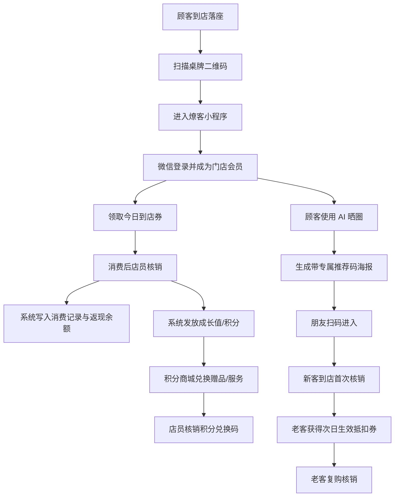

# 燎客 v3.1 系统运行逻辑与后续升级路线

> 版本：v1.0  
> 基于：PRD v3.0 + 积分模块 v3.1  
> 用途：给内部员工、开发团队、商家老板、投资人解释“燎客到底怎么运转”

## 1. 一句话讲清楚

燎客是把餐饮门店桌边真实客流转成私域会员、AI 分享内容、老带新新客、复购权益和可复盘数据的系统。

不是简单发券，也不是普通小程序。

## 2. 系统主闭环

## 3. 四套价值体系

| 体系 | 目的 | 是否现金属性 | 核心规则 |
|---|---|---|---|
| 成长值 | 会员等级 | 否 | 只升不降，决定等级和权益 |
| 余额 cashback | 复购抵扣 | 有消费抵扣属性，但不能提现 | 消费返现，下次抵扣，上限控制 |
| 老带新抵扣券 | 推荐激励 | 有消费抵扣属性，但不能提现 | 朋友首次消费后给老客次日生效券 |
| 积分 | 兑换赠品/服务 | 否 | 不抵现金、不提现、不转让 |

最重要的产品边界：

- 余额不是储值卡。
- 老带新不是分账。
- 积分不是现金。
- 邀请只做一级。

## 4. 三个后台

### 用户端

用户能做：

- 扫码进入门店。
- 领券。
- AI 晒圈。
- 查看余额、券、积分、邀请关系。
- 兑换积分商品。
- 出示券码、抵扣券码、积分兑换码。

### 商家端

商家能做：

- 核销优惠券。
- 核销老带新抵扣券。
- 核销积分兑换码。
- 查看今日数据。
- 配置门店基础信息、福利群、积分商品。
- 查看最近核销、扫码、AI 使用、积分兑换。

### 燎客运营后台

燎客内部能做：

- 创建商家和门店。
- 生成桌码。
- 配置券、返现、积分、AI 配额。
- 查看商家数据。
- 查看异常核销和风险事件。
- 管理合同、套餐、续费、数据导出。

## 5. v3.1 已经具备的成熟产品能力

- 到店扫码捕获真实用户。
- 微信登录生成门店会员。
- 今日券发放和核销。
- 消费返现余额。
- AI 文案和海报生成。
- 海报推荐码绑定邀请关系。
- 老带新抵扣券。
- 积分商城和积分兑换码。
- 商家端核销。
- 日统计和基础运营看板。
- 上线验收标准。
- 培训与路演手册。

## 6. 还需要继续补强的地方

### 产品侧

- 商家自助配置能力还弱。
- 数据周报和月报需要产品化。
- 积分商品管理页面需要更完善。
- 连锁多门店能力尚未形成。
- 核销撤销、误操作处理还需要标准功能。

### 技术侧

- 生产监控、告警、备份恢复必须上线前验证。
- AI 调用成本要有门店级限额。
- 数据权限和导出审计必须补。
- 测试环境和生产环境必须隔离。

### 运营侧

- 店员培训要标准化。
- 首周陪跑必须有 SOP。
- 商家老板要定期看到“算账结果”。
- 低活跃门店要有干预机制。

## 7. 版本路线图

### v3.2：提升线下可用性

- 核销撤销与回滚。
- 店员操作日志。
- 积分到期提醒。
- 老带新券面值 A/B 测试。
- 商家月报自动生成。
- 低活跃门店预警。

### v3.3：提升商家自助

- 商家自助入驻向导。
- 行业模板：火锅、烧烤、咖啡、茶饮、快餐。
- 商家自助生成桌牌。
- 券、积分、海报模板自助配置。
- 门店数据导出。

### v4.0：连锁品牌版

- 总部门店看板。
- 多门店对比。
- 品牌级活动同步。
- 区域经理账号。
- 同城同品类 benchmark。

### v5.0：AI 运营助手

- AI 自动识别门店经营问题。
- AI 推荐本周活动。
- AI 生成店员话术。
- AI 生成商家月报。
- AI 预测续费风险。

### App 阶段

不建议 v3.1 后立刻做 App。

只有当用户跨店权益、积分体系、会员身份、城市活动真正形成网络效应时，再做 App。否则 App 会变成高成本低留存的壳。

## 8. 对外讲法

### 给商家老板

> 燎客不是让你多装一个小程序，而是把每天已经坐在店里的客人沉淀下来，让他们领券、复购、晒圈、带朋友来，并且让你每周看到数据。

### 给店员

> 你只要记一句话：扫这个码有券，还能 AI 帮你做朋友圈大片。顾客出示码，你扫一下核销就行。

### 给投资人

> 燎客从单店桌边扫码切入，做的是本地餐饮的 AI 私域增长基础设施。短期靠 SaaS 订阅和交付服务，长期靠行业模板、数据 benchmark、连锁品牌版和 AI 运营助手形成规模化。

