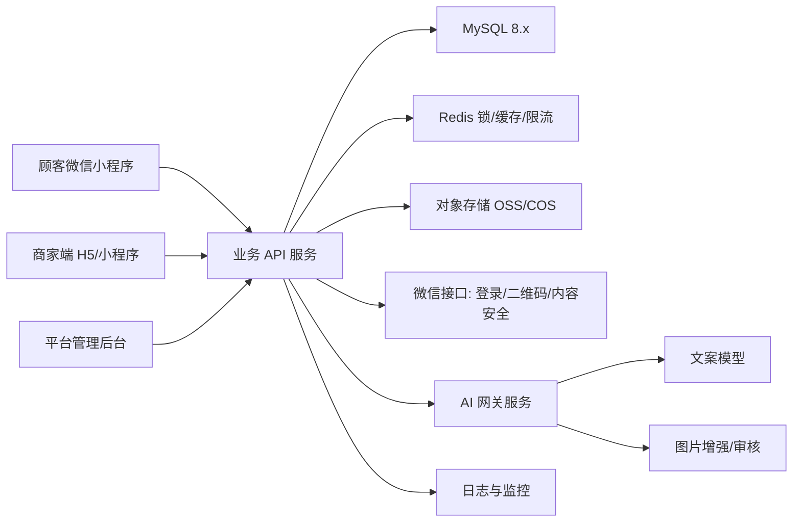

# 第 7 章：部署架构与运维方案

## 7.1 首版推荐架构

标准版 MVP 建议采用「小程序 + API 后端 + MySQL + Redis + 对象存储 + AI 网关」。



## 7.2 服务拆分

MVP 阶段不建议拆太多微服务，避免开发成本过高。

推荐三块：

| 服务 | 职责 | 是否必须独立 |
|------|------|--------------|
| 小程序 C 端 | 扫码、登录、领券、AI 玩法、海报保存 | 是 |
| 业务 API | 用户、会员、券、邀请、统计、商家端、平台端 | 是 |
| AI 网关模块 | 大模型密钥管理、提示词、调用记录、失败降级 | 可先在业务 API 内部实现 |

## 7.3 云资源建议

### 试点期最低配置

| 资源 | 建议 | 用途 |
|------|------|------|
| 云服务器 | 2 核 4G，1 台 | 后端 API + 管理后台 |
| MySQL | 2 核 4G 或云数据库基础版 | 业务数据 |
| Redis | 1G 基础版 | 幂等锁、限流、热点缓存 |
| 对象存储 | 标准存储 | 原图、增强图、海报 |
| CDN | 可选 | 海报图片加速 |
| 日志服务 | 可选，最低可先文件日志 | 排查 AI/核销/登录问题 |

### 稳定商用配置

| 资源 | 建议 |
|------|------|
| API 服务 | 2 台 2 核 4G + 负载均衡 |
| MySQL | 云数据库高可用版 |
| Redis | 主从版 |
| 对象存储 | 独立 bucket + CDN |
| 日志 | 日志服务 + 告警 |
| 备份 | MySQL 每日自动备份，保留 7-30 天 |

## 7.4 环境划分

必须至少有两个环境：

| 环境 | 用途 | 域名示例 |
|------|------|----------|
| test | 开发自测、你验收、模拟门店 | `https://test-api.xxx.com` |
| prod | 真实顾客使用 | `https://api.xxx.com` |

建议后续增加 `staging`，用于上线前验收。

## 7.5 环境变量

后端不得把密钥写死在代码中。

```bash
APP_ENV=prod
APP_PORT=8080
APP_BASE_URL=https://api.xxx.com

MYSQL_HOST=127.0.0.1
MYSQL_PORT=3306
MYSQL_DATABASE=ai_scan_card
MYSQL_USER=app_user
MYSQL_PASSWORD=change_me

REDIS_HOST=127.0.0.1
REDIS_PORT=6379
REDIS_PASSWORD=change_me

WECHAT_APP_ID=wx_xxx
WECHAT_APP_SECRET=change_me

OSS_BUCKET=ai-scan-card-prod
OSS_REGION=oss-cn-hangzhou
OSS_ACCESS_KEY_ID=change_me
OSS_ACCESS_KEY_SECRET=change_me

AI_TEXT_PROVIDER=qwen
AI_TEXT_API_KEY=change_me
AI_IMAGE_PROVIDER=aliyun_vision
AI_IMAGE_API_KEY=change_me

JWT_SECRET=change_me
INTERNAL_API_KEY=change_me
```

## 7.6 关键运行策略

### 幂等与锁

这些接口必须做 Redis 锁 + 数据库唯一约束：

- `/api/coupon/issue`
- `/api/coupon/verify`
- `/api/invite/bind`
- `/api/poster/generate`

锁 key 示例：

```text
lock:coupon:issue:{store_id}:{member_id}:{coupon_type}:{yyyy-mm-dd}
lock:coupon:verify:{coupon_code}
lock:invite:bind:{store_id}:{invitee_member_id}
```

### 限流

建议按三个维度限流：

| 维度 | 示例 |
|------|------|
| 用户 | 单用户每分钟最多 5 次 AI 请求 |
| 门店 | 单门店每分钟最多 100 次 AI 请求 |
| IP | 单 IP 每分钟最多 60 次非登录请求 |

### AI 降级

当 AI 文案接口失败：

1. 返回门店预设文案库 3 条。
2. 记录 `ai_tasks.status=fallback`。
3. 前端提示「高峰期 AI 稍慢，先给你几条精选文案」。

当图片增强失败：

1. 返回原图。
2. 前端提供基础滤镜。
3. 不阻塞发券和入群。

## 7.7 发布流程

### 后端

1. 开发合并到 `main`。
2. 跑单元测试和接口测试。
3. 构建镜像或打包。
4. 部署到 `test`。
5. 跑验收脚本。
6. 灰度到 `prod`。
7. 观察日志 30 分钟。

### 小程序

1. 开发版测试。
2. 体验版发给你和门店老板试用。
3. 修复真机问题。
4. 提交微信审核。
5. 审核通过后发布。

## 7.8 监控指标

首版至少记录这些指标：

| 指标 | 告警线 |
|------|--------|
| API 5xx 错误率 | 5 分钟内 > 2% |
| AI 文案失败率 | 15 分钟内 > 10% |
| AI 图片失败率 | 15 分钟内 > 15% |
| 核销失败率 | 15 分钟内 > 3% |
| Redis 连接失败 | 立即告警 |
| MySQL 慢查询 | 超过 1 秒记录 |

## 7.9 数据备份

- MySQL：每天凌晨自动备份。
- OSS/COS：开启版本控制或至少保留 7 天误删恢复。
- 配置与密钥：不要只保存在开发电脑，使用云厂商密钥管理或运维文档。

