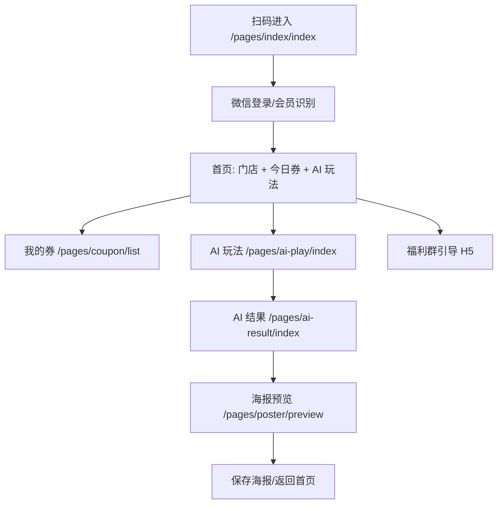

# 第 9 章：原型页面说明

本章是给产品、UI、前端一起看的低保真原型。首版不要做复杂营销页面，第一屏必须让顾客知道三件事：这是哪家店、我能领什么、我能玩什么。

品牌和 IP 规则见 `../brand-ip/README.md`。C 端核心页面默认接入系统级 IP「燎小星」；线下桌牌使用门店级 IP「AI × 小签」，牛里牛气试点为「AI 肉小签」。

## 9.1 C 端小程序页面结构



## 9.2 首页：扫码落地页

页面路径：`/pages/index/index`

### 页面目标

- 让顾客 3 秒内知道：这里可以领券，也可以玩 AI 晒图。
- 不强制分享，不写「发朋友圈才给优惠」。

### 低保真结构

```text
┌────────────────────────────┐
│ 牛里牛气潮汕牛肉火锅         │
│ 吃肉的人终会相遇             │
├────────────────────────────┤
│ 今日福利                     │
│ [领取今日吃肉券]              │
│ 已领后: [查看我的券]           │
├────────────────────────────┤
│ AI 朋友圈神器                 │
│ 上传随手拍，AI 帮你写高级文案    │
│ [开始生成]                   │
├────────────────────────────┤
│ [加入福利群] [我的券]          │
└────────────────────────────┘
```

### 状态

| 状态 | 展示 |
|------|------|
| 未登录 | 自动登录，页面显示加载 |
| 新会员 | 欢迎语 + 可领券 |
| 已领券 | 主按钮变为「查看我的券」 |
| 门店停用 | 显示「活动暂未开放」 |
| scene 无效 | 显示「二维码已失效，请联系店员」 |

## 9.3 我的券

页面路径：`/pages/coupon/list`

### 低保真结构

```text
┌────────────────────────────┐
│ 我的券                       │
├────────────────────────────┤
│ 今日吃肉券 85折               │
│ 有效至 今日 23:59              │
│ [出示核销码]                  │
├────────────────────────────┤
│ 老客奖励券 手切嫩肉一份          │
│ 有效至 2026-07-10              │
│ [出示核销码]                  │
├────────────────────────────┤
│ 已使用 | 已过期                │
└────────────────────────────┘
```

### 券二维码弹层

```text
┌────────────────────────────┐
│ 今日吃肉券                   │
│ 85 折                        │
│                              │
│          [二维码]             │
│                              │
│ 请在结账前出示给店员           │
│ [关闭]                       │
└────────────────────────────┘
```

## 9.4 AI 玩法页

页面路径：`/pages/ai-play/index`

### 页面目标

- 输入极简。
- 顾客不需要懂提示词。
- 每次只做一件事：上传图 + 写一句话。

### 低保真结构

```text
┌────────────────────────────┐
│ AI 朋友圈神器                 │
│ 今天这顿火锅，值得被记住        │
├────────────────────────────┤
│ [上传/拍一张火锅照片]          │
│                              │
│ 说一句你的真实感受             │
│ [吊龙太嫩了____________]       │
│                              │
│ 选择风格                     │
│ ( ) 肉食少女  ( ) 高级日常      │
│ ( ) 朋友安利  ( ) 小红书感      │
│                              │
│ [生成我的朋友圈素材]           │
└────────────────────────────┘
```

### 交互规则

- 图片非必传，但强烈引导上传。
- 文本为空时，可用预设选项：
  - 「今天肉很新鲜」
  - 「这家性价比可以」
  - 「朋友聚餐很舒服」
- 风格默认选「高级日常」。

## 9.5 AI 结果页

页面路径：`/pages/ai-result/index`

### 低保真结构

```text
┌────────────────────────────┐
│ 选择你喜欢的一版              │
├────────────────────────────┤
│ 文案 1                       │
│ 今天这顿吊龙嫩到离谱...        │
│ [选这个]                     │
├────────────────────────────┤
│ 文案 2                       │
│ 肉食少女打卡成功...            │
│ [选这个]                     │
├────────────────────────────┤
│ 图片效果                     │
│ [自然] [暖色] [高级感]          │
├────────────────────────────┤
│ [生成分享海报]                │
└────────────────────────────┘
```

### 异常状态

| 异常 | 页面处理 |
|------|----------|
| 文案 AI 超时 | 展示预设文案，提示「先给你精选版」 |
| 图片增强失败 | 使用原图，提示「图片已保留原始质感」 |
| 内容安全拒绝 | 提示用户换一张图或改一句话 |

## 9.6 海报预览页

页面路径：`/pages/poster/preview`

### 低保真结构

```text
┌────────────────────────────┐
│ 你的火锅朋友圈海报             │
├────────────────────────────┤
│ ┌────────────────────────┐ │
│ │        火锅图           │ │
│ │ 今天这顿吊龙嫩到离谱...  │ │
│ │ 牛里牛气潮汕牛肉火锅     │ │
│ │ [小程序码]              │ │
│ └────────────────────────┘ │
├────────────────────────────┤
│ [保存到相册]                 │
│ [复制文案]                   │
│ [再生成一次]                 │
└────────────────────────────┘
```

### 注意

- 按微信规范，只能引导保存，不要写强制分享话术。
- 海报上二维码 scene 必须带：
  - `store_id`
  - `inviter_id`
  - `post_id`

## 9.7 商家端核销页

可做成小程序分包页面或 H5。

页面路径：`/merchant/verify`

```text
┌────────────────────────────┐
│ 牛里牛气 商家核销             │
├────────────────────────────┤
│ [扫一扫顾客券码]               │
│ 或输入券码: [__________]       │
├────────────────────────────┤
│ 券详情                       │
│ 今日吃肉券 85折               │
│ 状态: 未使用                  │
│ 有效期: 今日 23:59             │
│                              │
│ 本单金额: [256.00____]         │
│ 优惠金额: 38.40               │
│ 应收金额: 217.60              │
│                              │
│ [确认核销]                    │
└────────────────────────────┘
```

## 9.8 商家端数据页

页面路径：`/merchant/dashboard`

```text
┌────────────────────────────┐
│ 今日数据                     │
├────────────────────────────┤
│ 扫码人数    42               │
│ 发券数量    38               │
│ 核销数量    35               │
│ AI 使用人数 18               │
│ 海报生成    7                │
│ 新客到店    3                │
│ 入群点击    12               │
├────────────────────────────┤
│ 最近核销记录                  │
│ 12:31 今日吃肉券 ¥256          │
│ 12:44 老客奖励券 手切嫩肉       │
└────────────────────────────┘
```

## 9.9 平台端页面

平台端首版可做简单 Web 管理后台。

### 门店管理

- 创建/编辑门店。
- 设置 Logo、slogan、关键词、福利群链接。
- 设置海报模板。

### 桌码管理

- 批量生成桌码。
- 下载二维码图片。
- 停用桌码。

### AI 配额

- 查看本月文案/图片使用量。
- 设置月度额度。
- 查看失败任务。

### 提示词管理

- 文案模板版本。
- 门店关键词。
- 禁用词。
