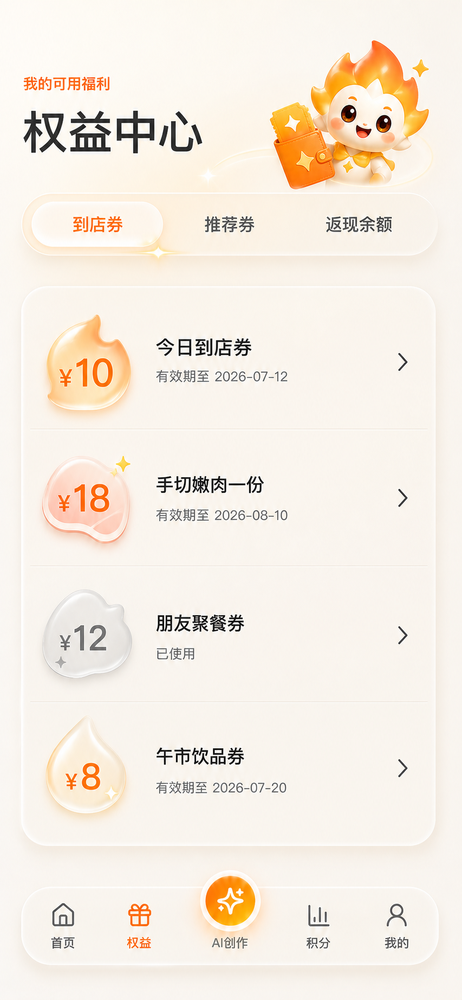

# 燎客「凝光玻璃」三端视觉升级设计规范

日期：2026-07-12  
状态：已批准视觉方向，等待书面规范复核  
基准分支：`codex/liaoke-three-surface-prototype`  
基准 PR：`#1`（保持 Draft）

## 1. 背景与问题

现有三端原型已完成业务、状态、权限和验收闭环，但视觉仍以白底、描边卡片和静态列表为主。以用户端权益中心为例，Tab、券列表、金额标识和底部导航的材质与交互反馈差异较小，页面呈现偏平、偏硬，缺少高端产品应有的纵深、折射和品牌识别。

本轮升级不重新设计业务结构，而是在保留当前信息架构、路由、状态机和权限模型的前提下，将视觉系统升级为收敛的 Fluent Acrylic 与 Liquid Glass 融合风格，并把燎小星从“页面插画”扩展为可复用的图形语法。

## 2. 设计目标

1. 通过少量雾面玻璃、局部折射、柔和光场和按压反馈建立高级感。
2. 保留燎客 Ember 橙、Reward Gold 和温暖餐饮气质，不变成蓝色科技或彩虹玻璃产品。
3. 让不同券、权益、积分、余额、核销和风险对象拥有可辨识的图形语言。
4. 用户端更有亲和力和 IP 感；商家端更利落；平台后台更克制、专业。
5. 在微信小程序和普通浏览器上提供可靠降级，避免玻璃效果牺牲可读性、性能或无障碍。

## 3. 非目标

- 不改变现有 20/20/16 路由数量。
- 不改变业务文案、状态机、积分账本、核销逻辑或权限边界。
- 不新增强制分享、现金提现或未在 PRD 中定义的功能。
- 不把所有容器都做成玻璃卡片，不使用卡片套卡片的视觉堆叠。
- 不复刻苹果或微软的品牌资产，只借鉴材质、层级和交互原则。

## 4. 已批准视觉目标

该画面是材质、图形、密度和品牌气质基准，不是像素级数据规范。实施时必须保留真实夹具数据、现有可访问名称和生产可行的 CSS/资源实现。

## 5. 视觉系统：Spark Glass / 凝光玻璃

### 5.1 材质层级

只允许四种材质层级：

1. **Base Canvas**：温暖象牙白底，使用一个低对比橙金环境光场，承载页面空间。
2. **Acrylic Sheet**：轻雾面分组面板，用于券列表、数据组、表格工具区；边缘弱、阴影浅。
3. **Liquid Lens**：只用于可交互焦点，如当前 Tab、主 CTA、AI 中心按钮、选中筛选器；有局部折射高光和轻微内阴影。
4. **Solid Ink Surface**：用于需要高信息密度或强可读性的表格、输入和确认区域；不得为了玻璃感降低对比度。

同一视口最多出现 2 个大面积 `backdrop-filter` 层。列表行主要通过半透明填充、分隔线和局部高光实现，不为每行重复昂贵模糊。

### 5.2 强度约束

- 相比初版 Liquid Glass 探索，将玻璃高光和描边强度降低约 35%。
- 不使用大面积彩色折射、虹彩边缘或镜面高光。
- 玻璃边缘只在光源方向出现，不做四边等亮描边。
- 阴影必须表达高度：底层 8–18px 软阴影，悬浮层 18–36px，按压态下降 2px 并收窄阴影。

### 5.3 色彩角色

- `Ember`：主要动作、当前状态、到店券、关键品牌标识。
- `Reward Gold`：奖励、成长、积分和推荐成功。
- `AI Cyan`：仅用于 AI 生成、AI 任务和 AI 状态，不进入普通玻璃高光。
- `Ash`：已使用、过期、暂停和只读辅助信息。
- `Ink`：标题和重要数据，任何玻璃层上仍需保持清晰对比。

## 6. 燎小星图形语法

燎小星保留完整角色形象，同时拆出五个可复用图形基因：

| 图形基因 | 来源 | 使用对象 |
| --- | --- | --- |
| 火焰尖角 | 头部火焰轮廓 | 到店券、主操作、热度、营业中 |
| 四角星芒 | 身体与票券星标 | 积分、奖励、推荐成功、AI 魔法 |
| 尾焰光迹 | 火焰运动轨迹 | Tab 滑动、流程进度、核销完成 |
| 软圆弧 | 面颊与身体比例 | 家庭/聚餐权益、普通信息容器 |
| 灰烬星点 | 火焰熄灭后的语义 | 已使用、过期、失败、暂停 |

完整燎小星只出现在：页面 Hero、成功/空/错误状态、首次引导和关键品牌时刻。普通列表不重复放完整角色，而使用上述图形基因，避免幼态化和视觉噪音。

## 7. 对象差异化规范

### 7.1 用户端权益

- 到店券：火焰尖角金额 Token，Ember 内发光。
- 菜品券：肉片/花瓣软轮廓 Token，Gold 星芒缺口。
- 聚餐/推荐券：软圆弧与双星连接，强调关系而非分享动作。
- 饮品券：液滴玻璃 Token 与小星反光。
- 已使用/过期：Ash 雾面、低亮星点，保持文字可读，不仅依赖颜色。
- 返现余额：液体储值槽/水位图形，不沿用券形状。
- 积分：星芒粒子和成长轨迹，不沿用现金金额样式。

### 7.2 商家端

- 使用较低透明度的 Acrylic Sheet，强调任务效率。
- 核销入口用对象图形区分：券、余额、推荐、积分礼品各有专属 Glyph。
- 成功态使用短尾焰轨迹和单次星芒，不铺满粒子。
- 老板/店长/店员角色用材质深浅和操作密度区分，不使用不同品牌色制造割裂。

### 7.3 平台后台

- 玻璃只用于侧栏、上下文抽屉、筛选浮层和重点风险提示。
- 表格主体保持高可读 Solid Ink Surface，不应用行级模糊。
- 风险类别使用图形和文字双重编码：频率脉冲、金额波纹、AI 星芒、任务时钟、核销回环。
- `platform_admin` 只读状态使用 Ash Acrylic，不能使用 AI Cyan 冒充权限状态。

## 8. 交互与动效

### 8.1 基础交互

- 行/卡 Hover：上移 1–2px，局部高光增强，阴影扩大但不改变布局。
- Press：缩放到 0.985–0.99，阴影收窄，高光向触点压缩。
- Tab 切换：玻璃 Lens 使用 220–300ms 弹性滑动，尾部带 80–120ms 的短光迹。
- Bottom Nav：当前项轻抬升；AI Orb 只在进入 AI 或完成任务时增强光晕。
- 展开/弹层：从触发对象附近产生，使用透明度、位移和模糊共同过渡。

### 8.2 高价值节点

继续沿用现有 Galacean 本地火花节点，但视觉强度与凝光玻璃统一：入口点亮、AI 进度、领券成功、真实升级、积分兑换、海报完成。列表、表格、核销确认和后台设置禁止挂载重动效。

### 8.3 减少动态效果

`prefers-reduced-motion: reduce` 下：

- 取消弹簧、视差和粒子播放。
- 状态变化保留 1ms 透明度切换和静态光晕。
- 不能因关闭动效丢失选中、成功或错误信息。

## 9. 组件边界

新增或重构的视觉组件应保持职责单一：

- `GlassSurface`：控制材质级别、模糊、边缘、降级。
- `LiquidLens`：控制选中/聚焦交互层。
- `RewardGlyph`：根据业务对象渲染火焰、肉片、液滴、星芒、灰烬等图形。
- `SparkTrail`：提供轻量 CSS 光迹，不替代 Galacean 高价值动效。
- `LiaoxiaoxingMoment`：统一完整 IP 形象、姿态、尺寸和出现条件。

业务页面只传递 `kind/state/emphasis`，不能自行拼接随机玻璃样式。

## 10. 技术与性能边界

- 首选 CSS 变量、伪元素、渐变、`backdrop-filter` 与现有品牌 PNG/SVG。
- `backdrop-filter` 不支持时回退到 92–96% 不透明暖白表面和标准软阴影。
- 不动态生成大量 SVG 滤镜，不引入新的 3D/UI 运行时。
- 手机主流程保持无横向溢出；玻璃不改变现有焦点顺序和可访问名称。
- 正文不低于现有产品字号；玻璃层上的正文与背景必须满足可读对比。
- 页面滚动时避免全屏滤镜重绘；大面积环境光使用固定或静态背景。

## 11. 三端实施顺序

1. **视觉基础层**：Token、GlassSurface、LiquidLens、RewardGlyph、交互与降级测试。
2. **用户端样板**：权益中心、首页、积分商城、AI 海报、成功/空状态；完成截图对比后扩展其余用户页。
3. **商家与后台**：按任务密度降低玻璃强度，保留同一图形语法和交互反馈。
4. **全局验收**：56 路由、五条主流程、响应式、reduced motion、截图和性能检查。

## 12. 测试与验收

- 业务单测和 130 条现有 E2E 不得回退。
- 新增材质降级、Reduced Motion、Tab 滑动状态、券类型 Glyph、按压反馈测试。
- 用户、商家手机视口无横向溢出；后台表格和文字保持可读。
- 选中权益中心必须与批准视觉目标进行同视口截图对比。
- 不出现卡片套卡片、全屏强反光、蓝色科技玻璃或强制分享文案。
- 完整燎小星出现位置符合第 6 节，不在普通列表重复堆叠。
- PR 在视觉改造和回归完成前保持 Draft。

## 13. 已知实现边界

- 视觉目标中的折射和液体形状需用可维护的 CSS Mask/渐变近似，不追求 GPU 昂贵的真实光学模拟。
- 原型海报的推荐码仍是占位符，真实二维码属于生产接入阶段。
- 微信原生小程序同步继续作为 React 原型视觉验收后的下一阶段，不在本轮混合实施。
